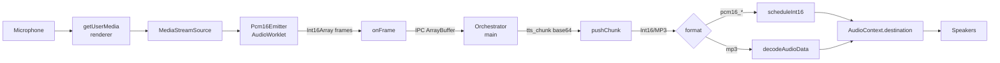

# Audio Pipeline

Audio I/O lives entirely in the **renderer** process because that's
where the Web Audio APIs live. Two classes own it:

- [`AudioCapture`](https://github.com/VivaldiCode/voice-gateway/blob/main/src/renderer/lib/audio-capture.ts)
  — microphone → PCM16 frames → IPC.
- [`AudioPlayback`](https://github.com/VivaldiCode/voice-gateway/blob/main/src/renderer/lib/audio-playback.ts)
  — IPC chunks → speaker via `AudioBufferSourceNode`.

The main process never touches `MediaStream` or `AudioContext` —
sandboxed renderers are exactly the right boundary for that.



## Capture: 48 kHz mic → 16 kHz mono PCM16

The mic produces float32 samples at the OS default rate (44.1 or
48 kHz on macOS). Whisper expects **mono PCM16 @ 16 kHz**. We do the
conversion in an `AudioWorklet` so the main thread never sees raw
audio frames.

### Worklet source (embedded as a string)

```js
class Pcm16Emitter extends AudioWorkletProcessor {
  constructor(options) {
    super();
    this.targetSampleRate = options.processorOptions.targetSampleRate;
    this.frameSamples = options.processorOptions.frameSamples;
    this.ratio = sampleRate / this.targetSampleRate;
    this.buffer = new Float32Array(this.frameSamples);
    this.cursor = 0;
    this.sourcePos = 0;
  }
  process(inputs) {
    const ch = inputs[0]?.[0];
    if (!ch) return true;
    for (let i = 0; i < ch.length; i++) {
      this.sourcePos += 1;
      while (this.sourcePos >= this.ratio) {
        this.sourcePos -= this.ratio;
        const a = ch[Math.max(0,i-1)] ?? 0;
        const b = ch[i] ?? a;
        const frac = 1 - (this.sourcePos / this.ratio);
        this.buffer[this.cursor++] = a + (b - a) * frac;   // linear interp
        if (this.cursor >= this.frameSamples) {
          const pcm = new Int16Array(this.frameSamples);
          for (let j = 0; j < this.frameSamples; j++) {
            const s = Math.max(-1, Math.min(1, this.buffer[j]));
            pcm[j] = s < 0 ? s * 0x8000 : s * 0x7fff;
          }
          this.port.postMessage(pcm.buffer, [pcm.buffer]);
          this.cursor = 0;
        }
      }
    }
    return true;
  }
}
```

Why a linear-interp downsampler and not a proper polyphase filter?
Because 16 kHz speech is already band-limited well below the 24 kHz
Nyquist of a 48 kHz stream — the aliasing cost is inaudible to a
speech-recognition model. The worklet runs in a real-time audio thread
where we **don't** want to pay for a 64-tap FIR.

`postMessage(pcm.buffer, [pcm.buffer])` uses the **Transferable** form
so we don't copy the buffer across the worklet boundary. That keeps
allocations to one ArrayBuffer per 20 ms frame.

### The PTT-press-release race

The worklet is loaded via `audioWorklet.addModule(url)` which is **async**.
If the user taps PTT very fast (press-release in <50 ms), `stop()` can
fire while `start()` is still awaiting `addModule(...)`. The next
`new AudioWorkletNode(ctx, ...)` then throws:

> Failed to construct 'AudioWorkletNode': No execution context available.

The fix is an `AbortController` per in-flight `start()`:

```ts
async start(opts: AudioCaptureOptions = {}): Promise<void> {
  if (this.ctx || this.currentStart) return;
  const ac = new AbortController();
  this.currentStart = ac;
  const aborted = (): boolean => ac.signal.aborted;
  ...
  await ctx.audioWorklet.addModule(url);
  if (aborted() || ctx.state === 'closed') {
    await ctx.close();
    stream.getTracks().forEach((t) => t.stop());
    return;
  }
  const node = new AudioWorkletNode(ctx, WORKLET_NAME, { ... });
  ...
}

async stop(): Promise<void> {
  this.currentStart?.abort();
  this.currentStart = null;
  ...
}
```

The history behind this is the
[regression report](https://github.com/VivaldiCode/voice-gateway/commits/main/src/renderer/lib/audio-capture.ts) —
the bug was a permanent ERROR state any time a user accidentally
double-tapped the call button.

### Friendly error mapping

`getUserMedia` rejects with DOMExceptions whose `.name` is rarely
helpful (`NotAllowedError`, `NotReadableError`, `OverconstrainedError`).
We map each to a Portuguese, actionable message in
`friendlyAudioError()`:

| DOMException name        | What we tell the user                                                       |
|--------------------------|-----------------------------------------------------------------------------|
| `NotAllowedError`        | "Permissão de microfone negada. Abre Definições do Sistema → Microfone…"    |
| `NotFoundError`          | "Não encontrei nenhum microfone. Liga o teu microfone e tenta de novo."     |
| `NotReadableError`       | "O microfone está ocupado. Fecha apps que estejam a gravar…"                |
| `OverconstrainedError`   | "O microfone seleccionado não suporta o formato pedido."                    |
| `AbortError`             | "Verifica em Definições do Sistema → Microfone se a Voice Gateway está autorizada — depois fecha e reabre a app." |

`OverconstrainedError` has a special fallback: we retry `getUserMedia`
without the `deviceId` constraint so a user who unplugs their USB mic
mid-session just falls back to the system default instead of seeing an
error toast.

## Playback: streaming TTS chunks

`AudioPlayback` handles two chunk formats:

| Format          | Source                  | Strategy                                                            |
|-----------------|-------------------------|---------------------------------------------------------------------|
| `pcm16_22050`   | Piper local             | One `AudioBufferSourceNode` per chunk, sample-accurate scheduling   |
| `pcm16_24khz`   | Server-side TTS         | Same as above, just 24 kHz                                          |
| `mp3`           | ElevenLabs              | Buffered, decoded once via `decodeAudioData` at `endUtterance()`    |

The PCM path **schedules each chunk back-to-back**:

```ts
const startAt = Math.max(ctx.currentTime, this.nextStartAt);
source.start(startAt);
this.nextStartAt = startAt + buffer.duration;
```

That `Math.max` is the safety net for clock skew — if a chunk arrives
later than its `nextStartAt` (network jitter), we just play it
immediately rather than scheduling in the past (which is silently
ignored by Web Audio).

MP3 is buffered because browsers expose no chunked MP3 decoder. The
trade-off is added latency: the user doesn't hear the first audio
until the ElevenLabs response finishes. For typical 20–80 word replies
that's <2 s.

### The user-gesture context activation

Chromium suspends `AudioContext`s that aren't created during a user
gesture. The call-button click triggers an IPC roundtrip and several
async hops before the first TTS chunk arrives — by then the gesture
is "gone". To beat this:

```ts
beginUtterance(format: PlaybackFormat): void {
  this.stop();
  this.pendingFormat = format;
  this.startedEmitted = false;
  this.mp3Chunks = [];
  this.nextStartAt = 0;
  // Eagerly create + resume the AudioContext now, while we still have
  // the user-gesture stack frame from the click handler.
  this.getCtx();
}
```

`beginUtterance` is called from the renderer's `useEffect([state])` the
moment the FSM transitions to `SPEAKING`. Because the state transition
itself is downstream of the user's PTT click, the document's "user
activation" flag is still hot — `getCtx()` creates and `resume()`s the
context successfully.

`getCtx()` is idempotent and also re-checks `state === 'suspended'`
every entry, so a sleeping context wakes up on the next chunk
regardless of how it got into that state.

## Why this lives in the renderer

Three reasons it would be painful in main:

1. `MediaStream` / `AudioContext` are Chromium APIs that don't exist in
   Node. We'd need `node-mic` (PortAudio bindings) + manual resampling.
2. The renderer is where TCC permission grants land (see
   [[macOS-Permissions]]). Microphone access from outside the renderer
   on macOS would prompt the user separately.
3. The renderer already has the React UI tied to the FSM state — gating
   the mic on `state === 'CAPTURING'` is one `useEffect` rather than an
   IPC ping-pong.

The audio crosses the IPC boundary as raw `ArrayBuffer`s
(transferable) for capture, and base64-encoded for playback (to keep
the React DevTools usable on the receiving side — see
[[IPC-Layer#conversation-control]]).
