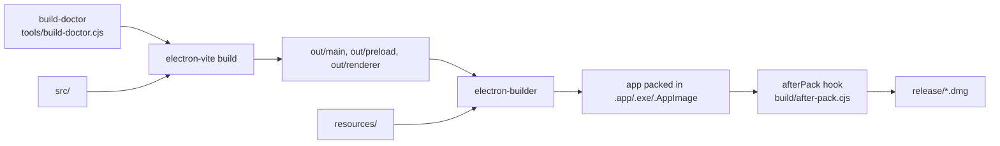
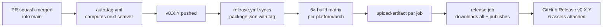

# Build and Packaging

The desktop app is bundled with
[electron-builder](https://www.electron.build/) into a macOS `.dmg`
(Apple Silicon arm64 target), a Linux `AppImage`, and a Windows
`nsis` installer. The default `npm run build` produces all three when
run on the matching host; CI uses
`npm run build:mac` / `:linux` / `:win` to target one platform.

Config: [`electron-builder.yml`](https://github.com/VivaldiCode/voice-gateway/blob/main/electron-builder.yml).
Pre-bundle Vite build:
[`electron.vite.config.ts`](https://github.com/VivaldiCode/voice-gateway/blob/main/electron.vite.config.ts).

## Pipeline



### build-doctor (pre-flight)

A ~50 ms Node script runs before every `build:mac|linux|win` and aborts
the build if any of a small set of `node_modules` entry points have
disappeared.

The check exists because the repo is sometimes mounted from an external
volume whose filesystem (exFAT, MS-DOS) doesn't preserve POSIX metadata
the way APFS does. Individual files inside `node_modules` occasionally
go missing without the parent tree being obviously broken — the most
recent victim was
`node_modules/builder-util/node_modules/fs-extra/lib/index.js` (issue
#48), which made electron-builder explode at startup with
`MODULE_NOT_FOUND`. Without the doctor the failure surfaces only
after `electron-vite build` has already run (5–8 s of wasted work) and
the error message points at builder-util internals, which is easy to
misdiagnose.

On failure the doctor prints the exact `rm -rf` + `npm install` command
to run; see [[Troubleshooting#build-fails-fast-with-module_not_found-inside-node_modules]]
for the full story.

To run it standalone:

```bash
npm run build-doctor
VG_BUILD_DOCTOR_VERBOSE=1 npm run build-doctor   # confirms which files were checked
```

The script is in CommonJS (`tools/build-doctor.cjs`) so it runs without
any TypeScript pipeline — critical because that pipeline is itself one
of the things being checked.

### electron-vite

Three build outputs:

| Bundle    | Format | Entry                 | Why                                                    |
|-----------|--------|-----------------------|--------------------------------------------------------|
| `main`    | ESM    | `src/main/index.ts`   | Modern Node ESM, top-level await available             |
| `preload` | **CJS**| `src/preload/index.ts`| Electron's sandboxed preload doesn't support ESM yet   |
| `renderer`| ESM    | `src/renderer/main.tsx` | React 18 + Vite HMR in dev                            |

The preload-as-CJS rule is a recurring bite point — see
[electron/electron #28981](https://github.com/electron/electron/issues/28981).
Vite is told `format: 'cjs', extension: '.cjs'` for that bundle so the
main process can `require()` the absolute path
`join(__dirname, '../preload/index.cjs')`.

The dev server:

```bash
npm run dev   # electron-vite dev — HMR on the renderer, restart on main changes
```

The dev server only handles the renderer; the main process is just
re-spawned on every TypeScript change.

## extraResources

```yaml
extraResources:
  - from: resources/python    → to: python      # wake_word_runner.py + requirements.txt
  - from: resources/piper     → to: piper       # (currently empty; voices live in userData)
  - from: resources/scripts   → to: scripts     # any one-off shell helpers
  - from: resources/icon.png  → to: icon.png    # used by Tray + window icon
  - from: resources/icon.svg  → to: icon.svg
  - from: resources/icons     → to: icons       # icon-16/32/64/...png
```

These end up in `Contents/Resources/` on macOS and
`resources/` on Linux/Windows. The main process picks them up via
`process.resourcesPath` — see
[`src/main/asset-paths.ts`](https://github.com/VivaldiCode/voice-gateway/blob/main/src/main/asset-paths.ts).

## macOS code signing

We **don't** have an Apple Developer ID. The build is ad-hoc-signed
instead — `codesign --sign -` — which is enough for the OS to remember
TCC permission grants across rebuilds.

The trick is that electron-builder's `identity: false` config doesn't
actually run `codesign` itself. It hands you a bundle whose binaries
are only "linker-signed" with a stale `Identifier=Electron`. macOS TCC
binds permissions to the
[Designated Requirement](https://developer.apple.com/documentation/security/code_signing_services)
of the bundle, so a fresh "Electron" identifier every rebuild means
every rebuild looks like a different app and the user's microphone
grant evaporates.

The
[`afterPack` hook](https://github.com/VivaldiCode/voice-gateway/blob/main/build/after-pack.cjs)
fixes this:

```js
execSync(
  `codesign --force --deep --options runtime --timestamp=none ` +
  `--entitlements build/entitlements.mac.plist --sign - "${appPath}"`,
);
```

| Flag                | Why                                                            |
|---------------------|----------------------------------------------------------------|
| `--force`           | Replace existing (linker-only) signatures                      |
| `--deep`            | Walk into Frameworks/ and resign every helper                  |
| `--options runtime` | Turn on the hardened runtime (otherwise entitlements ignored)  |
| `--timestamp=none`  | Skip Apple's TSA — we don't need notarization                  |
| `--entitlements …`  | Inject `audio-input`, `allow-jit`, `disable-library-validation` |
| `--sign -`          | Ad-hoc identity (no Developer ID needed)                       |

After signing, the hook also runs `codesign -dv` to print the resulting
signature info into the build log — useful when chasing "why is macOS
asking for permission again?" issues.

## Helper Info.plist patching

macOS checks `NSMicrophoneUsageDescription` on the **helper bundle's**
Info.plist, not just the main app's. electron-builder copies prebuilt
helper bundles verbatim from the Electron release tarball — they ship
with empty plists. Without the key, `getUserMedia({audio:true})` hangs
forever or rejects with `AbortError` even though the user clicked
Allow on the main app's prompt.

The same `afterPack` hook injects the key into every helper:

```js
for (const helper of fs.readdirSync(frameworksDir).filter(e => e.endsWith('.app'))) {
  const plistPath = path.join(frameworksDir, helper, 'Contents', 'Info.plist');
  if (!fs.existsSync(plistPath)) continue;
  execFileSync('plutil', ['-insert', 'NSMicrophoneUsageDescription', '-string', MIC_DESC, plistPath]);
}
```

See [[macOS-Permissions]] for the full rationale.

## Entitlements

[`build/entitlements.mac.plist`](https://github.com/VivaldiCode/voice-gateway/blob/main/build/entitlements.mac.plist):

```xml
<key>com.apple.security.device.audio-input</key>             <!-- mic permission -->
<key>com.apple.security.cs.allow-jit</key>                   <!-- V8 JIT          -->
<key>com.apple.security.cs.allow-unsigned-executable-memory</key>
<key>com.apple.security.cs.allow-dyld-environment-variables</key>
<key>com.apple.security.cs.disable-library-validation</key>  <!-- spawn whisper, piper, python -->
```

The last two are essential because we spawn external binaries
(`whisper-cli`, `piper`, `python3`). With hardened-runtime library
validation enabled, those child processes inherit our restrictions
and refuse to load anything not signed by us — which is fine for
Apple binaries but breaks Homebrew's whisper-cli the moment it tries
to load `libomp.dylib`.

## Resource-fork cleanup

The repo is sometimes mounted from an exFAT external disk, which
sprinkles `._*` AppleDouble files alongside every real file. They get
copied into the bundle and break codesign with "Operation not
permitted". The hook does a defensive cleanup:

```js
execFileSync('find', [appPath, '-name', '._*', '-delete'], { stdio: 'pipe' });
```

## Linux + Windows

Linux:

```yaml
linux:
  target: [AppImage]
  category: AudioVideo
  icon: resources/icon.png
```

AppImage builds are unsigned and require no Apple-equivalent ceremony.

Windows:

```yaml
win:
  target: [{ target: nsis, arch: [x64] }]
nsis:
  oneClick: false
  perMachine: false
  allowToChangeInstallationDirectory: true
```

Neither is regularly exercised by maintainers today — macOS is the
primary target.

## Asar = false

```yaml
asar: false
```

We disable asar so the on-disk layout under `Contents/Resources/app/`
is greppable. With ~50 MB of compiled output the size cost is
negligible.

## CI / Release pipeline

PR validation runs in
[`.github/workflows/ci.yml`](https://github.com/VivaldiCode/voice-gateway/blob/main/.github/workflows/ci.yml)
(lint + typecheck + vitest matrix + Playwright + Pytest + CodeQL).

DMG / EXE / AppImage release runs in a separate workflow,
[`.github/workflows/release.yml`](https://github.com/VivaldiCode/voice-gateway/blob/main/.github/workflows/release.yml),
that fires on `v*` tag pushes (and on manual `workflow_dispatch` for
ad-hoc testing). The split keeps PR runs cheap — six full installer
builds is slow and only needed when shipping.

### Build matrix

Six binaries, one per (platform, arch) pair, six parallel jobs:

| Platform | Arch  | Runner          | Artifact                                  |
|----------|-------|-----------------|-------------------------------------------|
| macOS    | arm64 | `macos-latest`  | `Voice Gateway-<v>-arm64.dmg`             |
| macOS    | x64   | `macos-13`      | `Voice Gateway-<v>-x64.dmg`               |
| Windows  | x64   | `windows-latest`| `Voice Gateway Setup <v>.exe`             |
| Windows  | arm64 | `windows-latest`| `Voice Gateway Setup <v>-arm64.exe`       |
| Linux    | x64   | `ubuntu-latest` | `Voice Gateway-<v>.AppImage`              |
| Linux    | arm64 | `ubuntu-latest` | `Voice Gateway-<v>-arm64.AppImage`        |

Why two different macOS runners: cross-build between mac arm64 and mac
x64 from a single runner doesn't work reliably because
`@electron/rebuild` needs the target arch's libraries on disk.
Windows arm64 and Linux arm64 cross-build cleanly from x64 hosts
because their installer payloads are the per-arch electron binary
(downloaded by electron-builder) plus our pure-JS bundle.

### Release flow



End-to-end the committer pushes a PR; everything past the squash-merge
is automated.

1. **PR squash-merged** into `main`.
2. **`auto-tag.yml`** runs on the merge commit, reads the squash-commit
   subject, computes the next semver:
   - `feat:` / `feat(scope):` → minor bump
   - `feat!:` / `BREAKING CHANGE` in body → major bump
   - anything else → patch bump
   - `[skip-tag]` in the commit message → opt out
3. `v0.X.Y` pushed; `release.yml` fires on the tag push.
4. **`release.yml` syncs `package.json`** with the pushed tag (in-place
   on the runner, no commit) so the DMG/EXE/AppImage filenames track
   the actual release version, not the stale `package.json` value.
5. The build matrix runs in parallel; each job uploads its artifacts.
6. A final `release` job (only on tag pushes — not on
   `workflow_dispatch`) downloads all six artifacts and publishes them
   via
   [`softprops/action-gh-release@v2`](https://github.com/softprops/action-gh-release).
   Auto-generates release notes unless a manual `gh release create`
   already ran for the same tag (in which case hand-written notes
   survive and only the assets are updated).

Manual tag push is still supported — useful for cutting an explicit
release (`git tag -a v0.X.Y && git push origin v0.X.Y`) without
relying on the auto-tag bump rule.

### The `--publish never` rule

`electron-builder` is invoked with `--publish never` in every build
job — without that flag it detects the tag context, decides it should
publish to GitHub Releases itself, looks for `GH_TOKEN`, fails on the
missing token, and crashes the build before any installer is written.

The framework's rule: **exactly one publisher per release** —
`softprops/action-gh-release@v2`. See issue #50 / PR #51 for the
specific failure mode this guards against; the rule lives in this
workflow's header comment too.

### Ad-hoc local builds

For local iteration the `build:*` npm scripts are enough — they never
try to publish:

```bash
npm test
npm run build:mac          # macOS arm64 (current host's arch)
npm run build:linux        # Linux x64
npm run build:win          # Windows x64
ls release/                # → Voice Gateway-<v>-<arch>.dmg/.exe/.AppImage
```

To build a specific cross-target locally, call electron-builder
directly:

```bash
npm run build
npx electron-builder --linux --arm64 --publish never
```

## Troubleshooting build failures

| Symptom                                                  | Likely cause                                                      |
|----------------------------------------------------------|-------------------------------------------------------------------|
| `codesign: object file format invalid or unsuitable`     | A stray `._*` AppleDouble file slipped into the bundle. The hook handles this; if it returns, check that `find` succeeded. |
| `Library not loaded: @rpath/Electron Framework`          | A helper wasn't re-signed. The hook walks Frameworks/; if you added new helpers, re-check. |
| Renderer blank after install                             | Vite's renderer outDir doesn't match `loadFile` path. The pattern is `out/renderer/index.html` → `join(__dirname, '../renderer/index.html')`. |
| Microphone permission lost across rebuilds               | Ad-hoc signing failed silently; check the `[after-pack]` codesign output for "main signature: <stuff>". |
| `hdiutil: create failed - No space left on device`       | The default `electron-builder` DMG path stages its temp file in `/private/var/folders/...` — i.e. on the system volume. If that volume is low on free space, `hdiutil` aborts even though the source bundle is small. **Workaround:** run `hdiutil create` manually with `TMPDIR` pointed at a roomier volume (typically the same drive that holds the source tree). The output DMG is identical for the end user; only the staging directory differs. |
| `MODULE_NOT_FOUND` inside `node_modules/...` immediately after `electron-vite build` finishes | A file inside `node_modules` has disappeared, typically a deeply-nested entry point on external/exFAT volumes. The `build-doctor` pre-flight should now catch this **before** `electron-vite build` runs; if you see this after the doctor passed, add the missing path to `CRITICAL_FILES` in `tools/build-doctor.cjs` and open a follow-up issue. |

Manual DMG when `/var/folders` is full:

```bash
TMPDIR=/Volumes/External\ 01/.tmp \
  hdiutil create \
    -srcfolder "release/mac-arm64/Voice Gateway.app" \
    -volname "Voice Gateway 0.1.0-arm64" \
    -anyowners -nospotlight \
    -format UDZO -fs HFS+ \
    "release/Voice Gateway-0.1.0-arm64.dmg"
```

Run `npm run build:mac --verbose` to see the full electron-builder log
plus our afterPack output.
