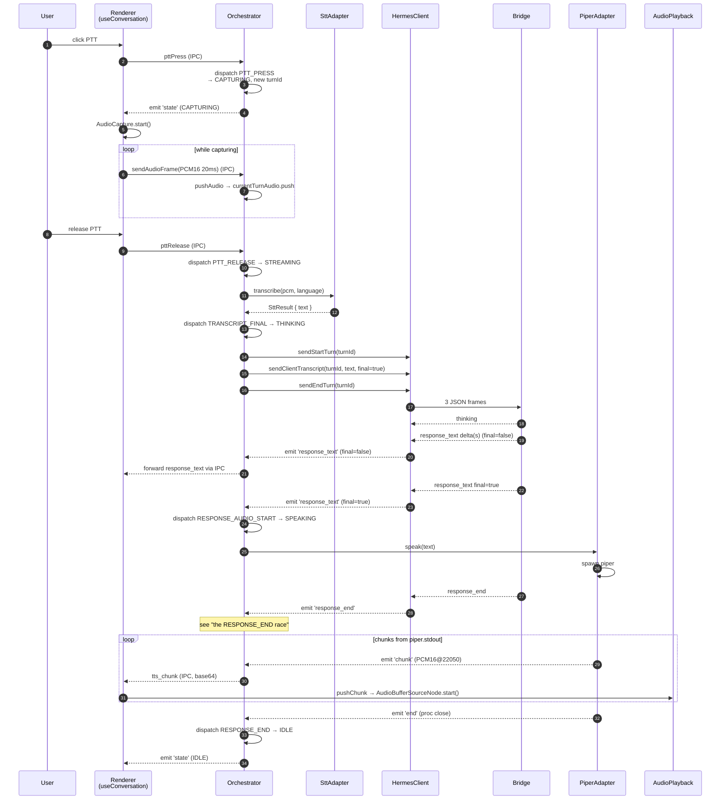

# Conversation Orchestrator

The orchestrator is the **single object** in the main process that owns a
running conversation. It glues:

- the [[State-Machine|pure FSM reducer]] (decision-making, no I/O),
- the [[WebSocket-Client|Hermes WebSocket client]] (server transport),
- the [[Speech-To-Text|STT adapter]] (mic PCM → text),
- the [[Text-To-Speech|TTS adapter]] (text → speaker PCM),

and exposes a tiny imperative API (`pttPress`, `pttRelease`, `cancel`,
`bargeIn`, `reset`) plus a typed `EventEmitter` interface that the
[[IPC-Layer]] bridges to the renderer.

Source:
[`src/main/services/conversation-orchestrator.ts`](https://github.com/VivaldiCode/voice-gateway/blob/main/src/main/services/conversation-orchestrator.ts).

## What it owns

```mermaid
flowchart TB
    subgraph Orch[ConversationOrchestrator]
        FSM[FSM reducer<br>state-machine.ts]
        Audio[currentTurnAudio<br>Buffer&#91;&#93;]
        Pending[pendingTtsTurnId<br>string &#124; null]
    end

    Renderer[Renderer<br>useConversation hook] -- IPC --> Orch
    Orch -- pttPress / pttRelease<br>pushAudio / cancel / bargeIn --> FSM
    Orch -- transcribe(pcm) --> STT[SttAdapter]
    STT -- text --> Orch
    Orch -- sendStartTurn<br>sendClientTranscript<br>sendEndTurn --> Client[HermesClient]
    Client -- thinking / response_text<br>response_audio_chunk / response_end --> Orch
    Orch -- speak(text) --> TTS[TtsAdapter]
    TTS -- chunk events --> Orch
    Orch -- emit 'state' / 'tts_chunk' / 'response_text' --> Renderer
```



The orchestrator is **the only place** where the FSM is mutated. Every
public method funnels through `dispatch()`:

```ts
private dispatch(event: ConversationEvent): void {
  const next = reduce(this.ctx, event, this.env);
  if (next === this.ctx) return;   // no-op transition
  this.ctx = next;
  this.emit('state', this.ctx);
}
```

The `next === this.ctx` short-circuit relies on the reducer returning the
**same reference** when an event doesn't apply — see the
[[State-Machine#tests|state-machine tests]]. This keeps the renderer's
re-render loop tight: stray events from old turns never trigger UI churn.

## A full turn, end to end



## Audio buffering: the `currentTurnAudio` deque

The renderer ships ~20 ms PCM16 frames over IPC during `CAPTURING`. The
orchestrator just appends them:

```ts
pushAudio(frame: Buffer | Uint8Array): void {
  if (this.ctx.state !== 'CAPTURING') return;
  this.currentTurnAudio.push(Buffer.isBuffer(frame) ? frame : Buffer.from(frame));
}
```

The `state !== 'CAPTURING'` guard discards stray frames that arrive after
a `cancel` or after `pttRelease` raced the WS — the renderer can pipe a
frame or two more before its `useEffect` cleanup tears the
`AudioWorklet` down.

On `pttRelease`, `finishCurrentTurn()` concatenates and:

1. Computes audio duration from byte count (PCM16 mono @ 16 kHz =
   32 bytes/ms).
2. If shorter than `activation.minAudioMs` (default 300 ms, configurable
   in the **Ativação** tab), emits a friendly `warning` and short-circuits
   to rest state without bothering STT or Hermes. This filters accidental
   button taps — see the original bug report in
   [issue history](https://github.com/VivaldiCode/voice-gateway/commits/main/src/main/services/conversation-orchestrator.ts).
3. Otherwise, awaits `stt.transcribe({ pcm, language })`. STT errors
   dispatch `ERROR` and emit `error` to the renderer.
4. If transcript is empty (silent user, model hallucinated nothing),
   transitions straight to IDLE — no Hermes call.
5. Otherwise dispatches `TRANSCRIPT_FINAL` (state → `THINKING`) and
   fires off `sendStartTurn` / `sendClientTranscript` / `sendEndTurn` on
   the WS.

## The RESPONSE_END race

The orchestrator binds to the [[WebSocket-Client]] for incoming server
messages:

```ts
this.client.on('response_text', (m) => {
  this.emit('response_text', m.text, m.final, m.turn_id);
  if (m.final && this.ctx.state === 'THINKING') {
    void this.speak(m.text, m.turn_id);   // sets state → SPEAKING
  }
});
this.client.on('response_end', () => {
  this.dispatch({ type: 'RESPONSE_END' });
});
```

There's a subtle race here. The bridge sends `response_text final=true`
and `response_end` back-to-back. Both messages arrive in quick
succession. `speak()` synchronously dispatches `RESPONSE_AUDIO_START`
(THINKING → SPEAKING) and then `await tts.speak(text)`. The next IPC
event handler fires `response_end`, which would dispatch `RESPONSE_END`
(SPEAKING → IDLE) **before** the first TTS chunk actually arrived at the
renderer. The React `useEffect([state])` then either misses the SPEAKING
tick entirely (React 18 batches the two consecutive `setState` calls) or
processes it after the chunks are already gone.

The fix is to **defer** the `response_end` dispatch while a local TTS is
still synthesising:

```ts
this.client.on('response_end', () => {
  if (this.pendingTtsTurnId) {
    // Local TTS is still running — its 'end' event will drive the
    // RESPONSE_END dispatch when audio actually finishes.
    return;
  }
  this.dispatch({ type: 'RESPONSE_END' });
});
```

`pendingTtsTurnId` is set in `speak()` immediately before the await and
cleared in `onTtsEnd` / `onTtsError`. So SPEAKING is held for the entire
TTS lifetime, the renderer sees the full SPEAKING window, and audio
playback runs to completion.

When the server provides audio itself (`response_audio_chunk` frames),
the orchestrator bumps `pendingTtsTurnId` is **not** used — the
deferral above only triggers for the local-TTS branch, exactly the
behaviour we want.

## Barge-in: the dispatch-before-stop dance

```ts
bargeIn(): void {
  // Order matters: dispatch first so any synchronous `end` event from a
  // stopped TTS adapter cannot prematurely walk the FSM out of SPEAKING.
  this.dispatch({ type: 'USER_INTERRUPT', reason: 'barge_in' });
  this.pendingTtsTurnId = null;
  this.tts.stop();
}
```

The order — **FSM first, stop second** — is intentional. Some
`TtsAdapter` implementations (notably the unit-test fake) emit `end`
synchronously from `stop()`, which would race the FSM into IDLE before
the `USER_INTERRUPT(barge_in)` transition could fire. Doing the
dispatch first guarantees we go SPEAKING → CAPTURING, never SPEAKING →
IDLE → CAPTURING.

`pendingTtsTurnId = null` ensures the late chunks that Piper might emit
between `kill('SIGTERM')` and `proc.on('close')` are dropped silently
(see `onTtsChunk`).

## Live adapter swap

Settings changes in **Voz** or **Reconhecimento** rebuild the relevant
adapter without restarting the app:

```ts
replaceSttAdapter(stt: SttAdapter): void {
  this.stt = stt;
}

replaceTtsAdapter(tts: TtsAdapter): void {
  this.unbindTts();
  this.tts = tts;
  this.bindTts();
}
```

The TTS variant unbinds chunk/end/error listeners first to avoid leaking
them onto the old adapter (which may still emit a final `end` from a
torn-down process). The new adapter is bound fresh.

In practice the main process today **rebuilds the whole orchestrator**
on every settings snapshot diff (`src/main/index.ts → settings.onChange`)
because the simpler "drop and replace" is bulletproof against partial
state. The `replaceXAdapter` methods are kept for future use and exhaustive
unit testing.

## Event surface (for the renderer)

| Event              | Payload                                | When                                          |
|--------------------|----------------------------------------|-----------------------------------------------|
| `state`            | `ConversationContext`                  | After any FSM transition                      |
| `transcript_final` | `text, turnId`                         | STT completed (after the empty-text filter)   |
| `response_text`    | `text, final, turnId`                  | Each delta from server (cumulative on final)  |
| `tts_chunk`        | `{ data, format, seq }, turnId`        | Each PCM/MP3 chunk to play                    |
| `error`            | `code, message`                        | Fatal — FSM also goes to ERROR                |
| `warning`          | `code, message`                        | Non-fatal hint (e.g. too-short capture)       |

The [[IPC-Layer]] forwards each of these to the renderer over a
dedicated channel (`vg:conv:state`, `vg:conv:transcript`, etc).

## Testing

[`tests/integration/conversation-orchestrator.test.ts`](https://github.com/VivaldiCode/voice-gateway/blob/main/tests/integration/conversation-orchestrator.test.ts)
boots the orchestrator with **fakes** for the WS client, STT adapter,
and TTS adapter, then drives it through full turn sequences and asserts
on:

- the FSM state at each step,
- emitted events (transcript, response_text, tts_chunk, error),
- the `currentTurnAudio` clearing on cancel,
- barge-in not racing the SPEAKING → CAPTURING transition.

If you change `finishCurrentTurn()` or any of the WS event bindings,
that file is where the regression tests live.
