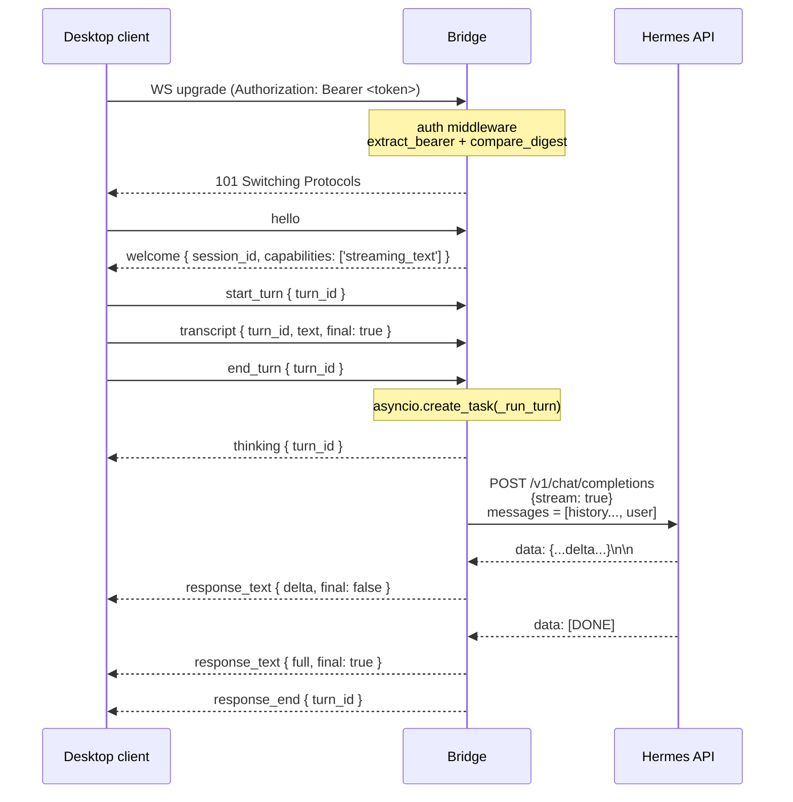

# Hermes Voice Bridge

The bridge is a tiny **Python aiohttp** WebSocket server that lives on
the same host as the Hermes agent and acts as a protocol adapter:

- Speaks the [[Protocol|Voice Gateway WS protocol]] to desktop clients.
- Speaks the **OpenAI Chat Completions** HTTP API to Hermes.

Why have it at all? Two reasons:

1. **Auth boundary.** Hermes' own API might be unauthenticated, or
   secured by a long-lived API key we don't want to ship to every
   desktop client. The bridge holds the Hermes key server-side and
   authenticates clients with a separate pairing token.
2. **Streaming bridge.** The desktop talks chunks-and-events over a
   WebSocket; Hermes streams Server-Sent Events. Converting between
   the two is exactly what aiohttp's request handlers are good at.

Source:
[`server/hermes-voice-bridge/`](https://github.com/VivaldiCode/voice-gateway/tree/main/server/hermes-voice-bridge).

## Module map

| File                    | Purpose                                                        |
|-------------------------|----------------------------------------------------------------|
| `__main__.py`           | `python -m hermes_voice_bridge` entrypoint → `server.run()`    |
| `server.py`             | aiohttp app, `/ws` and `/healthz` routes, per-turn dispatch    |
| `auth.py`               | Bearer token extraction + constant-time comparison             |
| `config.py`             | TOML loader for `/etc/hermes-voice-bridge/config.toml`         |
| `hermes_adapter.py`     | OpenAI chat-completions client with streaming + non-stream fallback |

The whole thing is ~600 lines including comments.

## Lifecycle of a single turn



## Authentication

The `_auth_middleware` runs on every request to `/ws`:

```python
async def _auth_middleware(request, handler):
    if request.path != "/ws":
        return await handler(request)
    token = extract_bearer(request.headers.get("Authorization"))
    if not is_valid_token(config.token, token):
        return web.Response(status=401, text="unauthorized")
    return await handler(request)
```

`is_valid_token` uses `hmac.compare_digest` so an attacker can't time
the comparison to recover the token byte-by-byte.

`/healthz` is intentionally unauthenticated — it's used by
`systemd`/uptime probes and returns `{ok: true, version}`.

## The chat history (`HermesAdapter`)

The adapter keeps a per-session deque of `{role, content}` messages so
multi-turn conversations work without the desktop having to resend
context every turn:

```python
class HermesAdapter:
    def __init__(self, ..., history_turns=16):
        self._history: Dict[str, Deque[Dict[str, str]]] = {}
        self._history_max = max(2, history_turns)

    def _record(self, session_id, role, content):
        d = self._history.setdefault(session_id, deque(maxlen=self._history_max))
        d.append({"role": role, "content": content})
```

`session_id` is the WS connection id minted in
`ws_handler` (`secrets.token_hex(8)`). When the socket closes, we drop
the history:

```python
finally:
    forget = getattr(adapter, "forget", None)
    if callable(forget):
        forget(session_id)
```

This means a reconnect starts fresh — by design. Persistent
multi-day memory is the Hermes agent's job (RAG, vector store, etc),
not the bridge's.

## Streaming + non-stream fallback

```python
async def stream_chat(self, *, text, session_id) -> AsyncIterator[str]:
    messages = self._session_messages(session_id)
    messages.append({"role": "user", "content": text})
    payload = {"model": self._model, "messages": messages, "stream": True}

    delta_count = 0
    async with self._session() as session:
        async with session.post(url, json=payload, headers=headers) as resp:
            if resp.status == 401: raise HermesUpstreamError(...)
            async for delta in _iter_sse_deltas(resp):
                if delta:
                    delta_count += 1
                    yield delta

    if delta_count == 0:
        # Some Hermes builds and proxies ignore stream=true.
        # Retry with stream=false and yield the whole body as one delta.
        fallback = await self._fetch_non_stream(text=text, headers=headers, messages=messages)
        if fallback:
            yield fallback
```

The fallback handles two real-world bugs:

1. Some Hermes builds parse `stream=true` but always reply with one
   final JSON body (no SSE).
2. Some HTTP proxies (Nginx without `proxy_buffering off`) accumulate
   the SSE stream into one chunk that arrives all-at-once with no
   `data:` line breaks.

The fallback path silently retries with `stream: false`, parses the
OpenAI shape (`choices[0].message.content`), and yields the whole text
as a single delta. The desktop client sees an identical
`response_text final=true → response_end` sequence either way.

## The SSE parser

```python
async def _iter_sse_deltas(resp) -> AsyncIterator[str]:
    buffer = b""
    async for chunk in resp.content.iter_any():
        buffer += chunk
        while b"\n" in buffer:
            raw_line, buffer = buffer.split(b"\n", 1)
            line = raw_line.decode("utf-8", errors="replace").rstrip("\r").strip()
            if not line: continue
            if line.startswith("data:"): line = line[5:].strip()
            if line in ("", "[DONE]"): continue
            yielded = _extract_delta(line)
            if yielded: yield yielded
    # Flush tail (some servers omit the trailing newline).
    ...
```

The previous implementation just iterated `resp.content` and split each
TCP chunk on `\n` directly. That broke when a `data: {...}\n\n` event
straddled two chunks — the JSON parser would see two half-objects and
silently drop both. The buffered version is robust to arbitrary chunk
boundaries.

`_extract_delta` handles three shapes:

| Server shape                                  | Parsed as            |
|-----------------------------------------------|----------------------|
| `{"choices":[{"delta":{"content":"X"}}]}`     | OpenAI streaming     |
| `{"choices":[{"message":{"content":"X"}}]}`   | OpenAI non-streaming |
| `{"text":"X"}` / `{"delta":"X"}` / `{"content":"X"}` | Tolerant fallbacks |
| Raw text (no JSON)                            | Treated as the delta |

So the bridge survives a surprising range of "OpenAI-compatible" APIs.

## Config

`/etc/hermes-voice-bridge/config.toml` is generated by `install.sh`
with mode `0640` and owner `root:hermes-voice`:

```toml
[bridge]
host = "0.0.0.0"
port = 8765
token = "<base64url 32-byte secret>"

[hermes]
base_url = "http://localhost:8642"
request_timeout = 30
api_key = ""           # Bearer for Hermes' own API, if it requires one
```

The path can be overridden via `HERMES_VOICE_BRIDGE_CONFIG` for tests
and dev environments.

## install.sh

[`server/install.sh`](https://github.com/VivaldiCode/voice-gateway/blob/main/server/install.sh)
is the one-liner installer:

```bash
curl -fsSL https://raw.githubusercontent.com/VivaldiCode/voice-gateway/main/server/install.sh | bash
```

What it does, in order:

1. **Re-exec under sudo** via a temp-file dance:
   ```bash
   if [ "$EUID" -ne 0 ]; then
     tmp=$(mktemp)
     cat > "$tmp" <<< "$(cat "$0")"   # or curl re-fetch
     exec sudo bash "$tmp" "$@"
   fi
   ```
   The naive `sudo -E bash "$0"` doesn't work when `$0` is `/dev/fd/63`
   (a bash process substitution from `curl … | bash`).
2. **Detect package manager** (`apt`, `dnf`, `pacman`, `apk`, `zypper`)
   and offer to install any of `curl`, `git`, `python3`, `python3-venv`
   that's missing. Prompts once per package; `--yes`/`ASSUME_YES=1`
   skips the prompt.
3. **Prompt** for bridge port (8765), Hermes URL (8642), and Hermes API
   key. Flags / env vars skip individual prompts:
   `--port`/`BRIDGE_PORT`, `--hermes-url`/`HERMES_URL`,
   `--hermes-api-key`/`HERMES_API_KEY`.
4. **Create system user** `hermes-voice` (no shell, no home).
5. **Create venv** at `/opt/hermes-voice-bridge/venv`, install the
   package from the repo's `server/hermes-voice-bridge` directory.
6. **Generate** a `secrets.token_urlsafe(32)` pairing token (or reuse
   existing on re-install — the script is idempotent).
7. **Write** `/etc/hermes-voice-bridge/config.toml`.
8. **Write** the `systemd` unit at
   `/etc/systemd/system/hermes-voice-bridge.service`.
9. `systemctl daemon-reload && systemctl enable --now hermes-voice-bridge`.
10. **Print** the pairing token + bridge URL in a friendly banner.

The script is **idempotent** — re-running upgrades the Python package
and preserves the token and Hermes API key. Pass any flag to override
defaults for unattended installs (CI / packer / Ansible).

## systemd unit

```ini
[Unit]
Description=Hermes Voice Bridge
After=network.target

[Service]
Type=simple
User=hermes-voice
Group=hermes-voice
ExecStart=/opt/hermes-voice-bridge/venv/bin/python -m hermes_voice_bridge
Restart=on-failure
RestartSec=2

[Install]
WantedBy=multi-user.target
```

Logs go to journald — `journalctl -fu hermes-voice-bridge` is the
canonical debug tool. The expected log line per successful turn:

```
hermes responded 200 (Content-Type=text/event-stream)
hermes stream done — N delta(s), M chars total
```

If you see "hermes responded 200 (Content-Type=application/json)"
followed by "non-stream fallback OK" — Hermes ignored `stream: true`
and the fallback kicked in. That's working as intended, just slower
because the user has to wait for the entire response before seeing
text.

## Customising the Hermes adapter

If your Hermes API is shaped differently (different path, different
auth, different response format), edit
[`hermes_adapter.py`](https://github.com/VivaldiCode/voice-gateway/blob/main/server/hermes-voice-bridge/src/hermes_voice_bridge/hermes_adapter.py)
and `systemctl restart hermes-voice-bridge`. Keep the
`async def stream_chat(*, text, session_id) -> AsyncIterator[str]`
signature so the rest of the bridge keeps working.

The HTTP layer (`_session`, headers, auth) is yours to change — the
default uses Bearer auth when `hermes.api_key` is set.

## Tests

The bridge has a pytest suite at
[`server/hermes-voice-bridge/tests/`](https://github.com/VivaldiCode/voice-gateway/tree/main/server/hermes-voice-bridge/tests)
that exercises:

- the `/ws` upgrade with valid + invalid tokens,
- the welcome handshake,
- a fake `HermesAdapter` that yields chosen deltas,
- the non-stream fallback path,
- SSE chunk-boundary edge cases.

Run with `pytest -q` from inside the venv. The TS-side end-to-end test
(`tests/integration/bridge-text-roundtrip.test.ts`) hits a real
running bridge — see [[Testing-Guide]].
