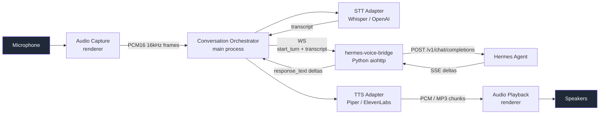

<p align="center">
  
</p>

# Voice Gateway Wiki

Voice Gateway is a desktop client that lets you **talk to a self-hosted
[Hermes agent](https://hermes-agent.nousresearch.com/) by voice**. It
supports push-to-talk and wake-word activation, runs speech-to-text and
text-to-speech **locally by default** (no API keys required), and treats
cloud upgrades (OpenAI Whisper, ElevenLabs) as opt-in convenience.

This wiki documents how every layer of the project works, from the
WebSocket bytes on the wire to the React component tree, with code
references throughout.

## The 30-second mental model



The renderer process owns the microphone and speakers because that's
where the Web Audio APIs live. Everything else — STT, TTS, WebSocket,
the conversation state machine — lives in the Electron main process.
Audio frames cross the IPC boundary as raw `ArrayBuffer`s; control flow
crosses as typed JSON messages.

## Where to start reading

| If you want to… | Read |
|---|---|
| Get the app running on your Mac | **[[Setup]]** |
| Understand how a single voice turn flows through the system | **[[Conversation-Orchestrator]]** then **[[State-Machine]]** |
| Add a new STT or TTS backend | **[[Speech-To-Text]]** or **[[Text-To-Speech]]** |
| Change the wire protocol | **[[Protocol]]** |
| Debug a failing turn | **[[Troubleshooting]]** |
| Build, sign, and ship a release | **[[Build-And-Packaging]]** |
| Run the test suite | **[[Testing-Guide]]** |
| Modify the Python bridge | **[[Hermes-Voice-Bridge]]** |

The **[[Architecture]]** page is the recommended next stop after this
one — it explains why the boundaries are where they are.

## Local-first by default

Both STT and TTS ship with a zero-cost local path:

| Component | Local default                         | Cloud upgrade                                    |
|-----------|---------------------------------------|--------------------------------------------------|
| STT       | [whisper.cpp][whisper] (`base` ggml)  | [OpenAI Whisper API][openai-whisper]             |
| TTS       | [piper-tts][piper] (`en_US-lessac-medium`) | [ElevenLabs][el] (`eleven_turbo_v2_5`)      |
| Wake word | [openWakeWord][oww] (Python child)    | —                                                |

The local binaries are auto-installed on first use — see
[[Speech-To-Text]] and [[Text-To-Speech]]. Cloud upgrades require an API
key entered in the **Settings → Voz** / **Settings → Reconhecimento**
tabs; the app never phones home without explicit consent.

[whisper]: https://github.com/ggerganov/whisper.cpp
[openai-whisper]: https://platform.openai.com/docs/guides/speech-to-text
[piper]: https://github.com/rhasspy/piper
[el]: https://elevenlabs.io
[oww]: https://github.com/dscripka/openWakeWord

## Repository layout

```
voice-gateway/
├── src/
│   ├── shared/         # Imports legal in any Electron process — no Node deps
│   ├── main/           # Electron main process
│   │   └── services/   # WS client, STT, TTS, wake word, orchestrator
│   ├── preload/        # contextBridge API surface
│   └── renderer/       # React UI
├── server/
│   ├── hermes-voice-bridge/   # Python aiohttp bridge
│   └── install.sh             # one-liner installer
├── resources/          # icons, scripts, Python wake-word runner
├── tests/              # vitest (unit + integration) + Playwright (E2E)
├── docs/               # this wiki (synced via docs/sync-wiki.sh)
└── build/              # macOS entitlements + afterPack hook
```

The full module map with one-line descriptions per directory is in
[[Architecture]] under "Module map".

## Source

- Code: <https://github.com/VivaldiCode/voice-gateway>
- Bug tracker: <https://github.com/VivaldiCode/voice-gateway/issues>
- Releases: <https://github.com/VivaldiCode/voice-gateway/releases>
- This wiki: also lives at <https://github.com/VivaldiCode/voice-gateway/tree/main/docs>
