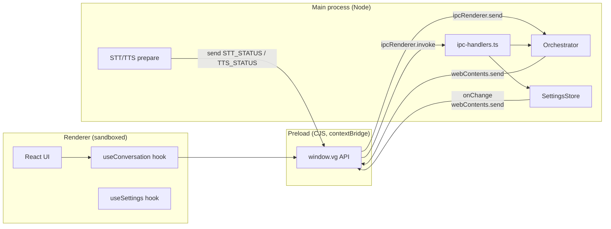

# IPC Layer

The Electron IPC surface between the **main** process (services,
WebSocket, audio adapters) and the **renderer** (React UI, microphone,
speakers). Designed around three rules:

1. **Sandboxed renderer.** The renderer runs with `contextIsolation: true`
   and `sandbox: true`. The only API it sees is whatever
   `contextBridge.exposeInMainWorld('vg', api)` exposes from the preload
   script — no direct `ipcRenderer`, no Node.
2. **Typed channels.** Every channel name lives in
   [`shared/constants.ts`](https://github.com/VivaldiCode/voice-gateway/blob/main/src/shared/constants.ts)
   under the `IPC` object. The preload and the main process both import
   the same enum so a rename is a single edit.
3. **One direction per channel.** A request/response uses
   `ipcMain.handle` + `ipcRenderer.invoke`. A push-from-main uses
   `webContents.send` + `ipcRenderer.on`. We never overload a channel
   with both.

Source:
[`src/preload/index.ts`](https://github.com/VivaldiCode/voice-gateway/blob/main/src/preload/index.ts) (the contextBridge surface),
[`src/main/ipc-handlers.ts`](https://github.com/VivaldiCode/voice-gateway/blob/main/src/main/ipc-handlers.ts) (the
request/response handlers), and
[`src/main/index.ts`](https://github.com/VivaldiCode/voice-gateway/blob/main/src/main/index.ts)
(the push-from-main `webContents.send` calls).

## Architecture



## The full channel map

All channels are prefixed `vg:` for grep-ability.

### Health

| Channel    | Kind        | Direction       | Payload | Purpose                       |
|------------|-------------|-----------------|---------|-------------------------------|
| `vg:ping`  | `invoke`    | renderer → main | —       | Returns `'pong'`. Used by E2E to confirm the preload bridge is alive. |

### Settings

| Channel                 | Kind     | Direction       | Payload                  |
|-------------------------|----------|-----------------|--------------------------|
| `vg:settings:get`       | `invoke` | renderer → main | → `Settings`             |
| `vg:settings:set`       | `invoke` | renderer → main | `Partial<Settings>` → `Settings` |
| `vg:settings:reset`     | `invoke` | renderer → main | → `Settings`             |
| `vg:settings:changed`   | `send`   | main → renderer | `Settings`               |
| `vg:settings:open-window` | `send` | renderer → main | —                        |

`vg:settings:changed` is broadcast to **every** open `BrowserWindow`
(see `registerIpcHandlers → settings.onChange`). The main window AND
the Settings window both stay in sync with the persisted state.

### Pairing

| Channel         | Kind     | Direction       | Payload                          |
|-----------------|----------|-----------------|----------------------------------|
| `vg:pair:test`  | `invoke` | renderer → main | `PairingInfo` → `PairTestResult` |
| `vg:pair:save`  | `invoke` | renderer → main | `PairingInfo` → `PairTestResult` |

The save variant tests first, persists on success. Errors map to
friendly Portuguese messages in
[`testPairing`](https://github.com/VivaldiCode/voice-gateway/blob/main/src/main/ipc-handlers.ts).

### Connection status

| Channel                   | Kind   | Direction       | Payload                                                                |
|---------------------------|--------|-----------------|------------------------------------------------------------------------|
| `vg:connection:status`    | `send` | main → renderer | `{ status, latencyMs, lastError }`                                     |

Emitted on every `'status'` event from
[[WebSocket-Client|`HermesClient`]] (connecting → connected → error etc).

### Conversation control

Push-to-talk and command channels are **send-only** because they're
intentionally fire-and-forget:

| Channel                | Direction       | Payload         | Effect                            |
|------------------------|-----------------|-----------------|-----------------------------------|
| `vg:conv:ptt:press`    | renderer → main | —               | `orchestrator.pttPress()`         |
| `vg:conv:ptt:release`  | renderer → main | —               | `orchestrator.pttRelease()`       |
| `vg:conv:audio-frame`  | renderer → main | `ArrayBuffer`   | `orchestrator.pushAudio(buf)`     |
| `vg:conv:cancel`       | renderer → main | —               | `orchestrator.cancel()`           |
| `vg:conv:barge-in`     | renderer → main | —               | `orchestrator.bargeIn()`          |
| `vg:conv:reset`        | renderer → main | —               | `orchestrator.reset()`            |

Conversation events go the other way:

| Channel                | Direction       | Payload                                                       |
|------------------------|-----------------|---------------------------------------------------------------|
| `vg:conv:state`        | main → renderer | `ConversationContext`                                         |
| `vg:conv:transcript`   | main → renderer | `{ text, turnId, role: 'user' \| 'assistant' }`               |
| `vg:conv:response-text`| main → renderer | `{ text, final, turnId }`                                     |
| `vg:conv:tts-chunk`    | main → renderer | `{ seq, format, turnId, data: base64 }`                       |
| `vg:conv:error`        | main → renderer | `{ code, message }`                                           |
| `vg:conv:warning`      | main → renderer | `{ code, message }`                                           |

**Why base64 for `tts-chunk`?** `webContents.send` serialises payloads
with the structured clone algorithm, which supports `ArrayBuffer`
natively, but `electron-store` and the React DevTools both have trouble
displaying raw binary in transit. base64 trades 33% size for a sane
debug story — for a 30 ms PCM chunk at 22 050 Hz (~1.3 kB), the inflation
is negligible compared to the latency of going through React state.

### Audio (renderer-side hardware diagnostics)

| Channel                 | Kind     | Payload                                |
|-------------------------|----------|----------------------------------------|
| `vg:audio:mic-status`   | `invoke` | → `'granted' \| 'denied' \| 'restricted' \| 'not-determined' \| 'unknown'` |
| `vg:audio:mic-request`  | `invoke` | → `boolean` (true = user granted)      |
| `vg:audio:open-mic-settings` | `invoke` | → `boolean` (true on macOS only)   |

`mic-status` calls `systemPreferences.getMediaAccessStatus('microphone')`
on macOS, returns `'granted'` everywhere else. `open-mic-settings`
shells out to
`x-apple.systempreferences:com.apple.preference.security?Privacy_Microphone`
so the user lands directly on the right pane.

### STT / TTS lifecycle

| Channel              | Kind     | Direction       | Payload                                                                                                   |
|----------------------|----------|-----------------|-----------------------------------------------------------------------------------------------------------|
| `vg:stt:status`      | `send`   | main → renderer | `{ state: 'idle' \| 'preparing' \| 'ready' \| 'error', progress?, message? }`                              |
| `vg:stt:prepare`     | `invoke` | renderer → main | → `{ ok, message? }` — force a re-check (e.g. user just `brew install`-d whisper)                          |
| `vg:tts:status`      | `send`   | main → renderer | same shape as STT                                                                                          |
| `vg:tts:prepare`     | `invoke` | renderer → main | → `{ ok, message? }`                                                                                       |
| `vg:tts:list-voices` | `invoke` | renderer → main | `{ provider: 'elevenlabs', apiKey }` → `{ ok, voices, message? }`                                          |
| `vg:tts:test`        | `invoke` | renderer → main | `TestVoiceRequest` → `{ ok, message? }` — used by the Settings → Voz "Test" button                          |
| `vg:audio:test-tts-chunk` | `send` | main → renderer | `{ seq, format, data: base64, done? }` — chunks from the test-voice call so the same playback layer plays |

### Hotkey

| Channel              | Kind   | Direction       | Payload                  |
|----------------------|--------|-----------------|--------------------------|
| `vg:hotkey:trigger`  | `send` | main → renderer | `'press' \| 'release'`   |

Emitted from `globalShortcut` in
[`src/main/global-shortcut.ts`](https://github.com/VivaldiCode/voice-gateway/blob/main/src/main/global-shortcut.ts).
Today the renderer treats this purely as a UI flash hint (state-driven
buttons do the real work).

### Wake word

| Channel              | Kind   | Direction       | Payload                                |
|----------------------|--------|-----------------|----------------------------------------|
| `vg:wake:status`     | `send` | main → renderer | `{ running, models? }` or `{ error }`  |
| `vg:wake:detected`   | `send` | main → renderer | (reserved — used by the tray today)    |

## The preload contract

The preload script is the **only** code with both `ipcRenderer` access
and access to `window`. It exposes a typed `vg` namespace via
`contextBridge.exposeInMainWorld`:

```ts
// src/preload/index.ts (excerpt)
const api = {
  settings: {
    get:    () => ipcRenderer.invoke(IPC.SETTINGS_GET),
    set:    (patch) => ipcRenderer.invoke(IPC.SETTINGS_SET, patch),
    onChange: (cb) => on(IPC.SETTINGS_CHANGED, cb),
    ...
  },
  conversation: {
    pttPress:    () => ipcRenderer.send(IPC.CONV_PTT_PRESS),
    pttRelease:  () => ipcRenderer.send(IPC.CONV_PTT_RELEASE),
    sendAudioFrame: (frame: ArrayBuffer) => ipcRenderer.send(IPC.CONV_AUDIO_FRAME, frame),
    onTtsChunk: (cb) => on(IPC.CONV_TTS_CHUNK, cb),
    ...
  },
  ...
};
contextBridge.exposeInMainWorld('vg', api);
```

Notes:

- `on()` is a tiny helper that wraps `ipcRenderer.on` and returns an
  unsubscribe function — the preload never lets the renderer touch the
  raw `IpcRendererEvent` (which leaks `sender` references).
- The preload is **CommonJS** (`index.cjs`). electron-vite bundles it
  with `format: 'cjs'` because Electron's sandbox + ESM combination
  doesn't fully work yet — see [[Build-And-Packaging]].

## Multi-window broadcast pattern

The Settings panel lives in a separate `BrowserWindow`. To keep both
windows in sync, the main process broadcasts events to **every** open
window via this helper:

```ts
function send(channel: string, payload: unknown): void {
  for (const win of BrowserWindow.getAllWindows()) {
    if (!win.isDestroyed()) win.webContents.send(channel, payload);
  }
}
```

That's why opening Settings while a turn is in flight doesn't lose
state — the freshly-opened window receives the next `CONV_STATE`,
`STT_STATUS`, `TTS_STATUS` tick like any other.

The Settings window also receives a one-shot snapshot on
`ready-to-show` so its UI never starts in a "preparing…" placeholder
state.
