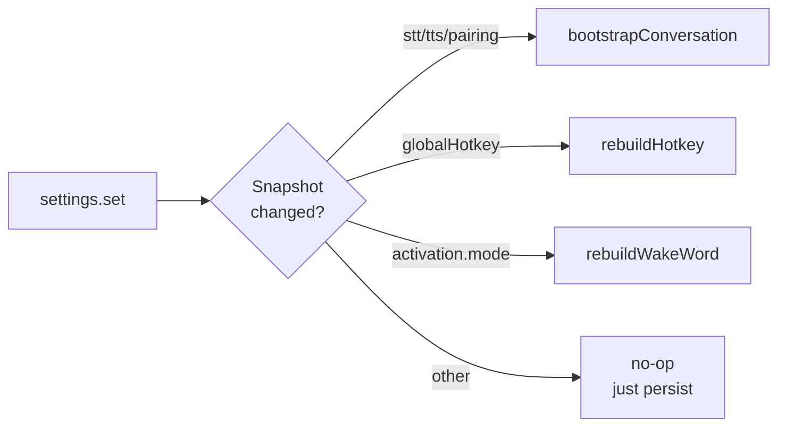

# Settings and Storage

Persistent configuration lives in
[`src/main/services/settings-store.ts`](https://github.com/VivaldiCode/voice-gateway/blob/main/src/main/services/settings-store.ts).
It's a thin wrapper around
[`electron-store`](https://github.com/sindresorhus/electron-store) with:

- a single typed schema (`Settings`),
- a **deep merge** for partial updates,
- a `schemaVersion`-driven migration hook,
- a tiny pub/sub for `onChange` listeners.

The schema is declared in
[`src/shared/types.ts`](https://github.com/VivaldiCode/voice-gateway/blob/main/src/shared/types.ts).
Everything that touches settings — main process services, IPC handlers,
the React Settings UI — goes through the same `Settings` type.

## On-disk location

`electron-store` writes a single JSON file:

| Platform | Path                                                                              |
|----------|-----------------------------------------------------------------------------------|
| macOS    | `~/Library/Application Support/Voice Gateway/voice-gateway-settings.json`         |
| Linux    | `~/.config/Voice Gateway/voice-gateway-settings.json`                             |
| Windows  | `%APPDATA%\Voice Gateway\voice-gateway-settings.json`                             |

It's plain JSON — safe to hand-edit when the app isn't running, but the
[[Renderer-UI#settingspanel|Settings UI]] is faster and validates.

## The schema

```ts
export interface Settings {
  pairing: PairingInfo | null;          // bridge URL + token
  activation: ActivationSettings;       // PTT/wake mode, hotkey, minAudioMs
  stt: SttSettings;                     // provider + language + per-provider config
  tts: TtsSettings;                     // provider + Piper/ElevenLabs config
  audio: AudioSettings;                 // device IDs
  ui: UiSettings;                       // language, theme, startMinimized
  schemaVersion: number;                // bumped on breaking schema changes
}
```

Defaults are the **local-first** stack:

```ts
{
  stt: { provider: 'whisper_local', whisperLocal: { model: 'base' }, ... },
  tts: { provider: 'piper_local', piper: { modelId: 'en_US-lessac-medium' }, ... },
  activation: { mode: 'PUSH_TO_TALK', minAudioMs: 300, ... },
  ui: { language: 'pt', theme: 'dark', startMinimized: false },
}
```

See `defaultSettings()` in
[`settings-store.ts`](https://github.com/VivaldiCode/voice-gateway/blob/main/src/main/services/settings-store.ts).

## Deep merge

Naive `Object.assign` would clobber nested settings — if the renderer
sends `{ stt: { language: 'pt' } }` we don't want to wipe the OpenAI
API key the user typed yesterday.

```ts
function deepMerge<T>(a: T, b: Record<string, unknown>): Record<string, unknown> {
  const out = { ...a };
  for (const [k, v] of Object.entries(b)) {
    const prev = out[k];
    if (v !== null && typeof v === 'object' && !Array.isArray(v) &&
        prev !== null && typeof prev === 'object' && !Array.isArray(prev)) {
      out[k] = deepMerge(prev, v);
    } else {
      out[k] = v;
    }
  }
  return out;
}
```

Arrays are replaced wholesale (so swapping the wake-word list is
intuitive). `null` values are honoured (so the user can explicitly
unset the pairing or an output device).

## Migrations

The store remembers `schemaVersion`. On boot:

```ts
const existing = store.get('settings');
if (existing.schemaVersion !== SCHEMA_VERSION) {
  log.info('[VG] migrating settings', { from: existing.schemaVersion, to: SCHEMA_VERSION });
  const migrated = mergeSettings(defaultSettings(), existing);
  migrated.schemaVersion = SCHEMA_VERSION;
  store.set('settings', migrated);
}
```

This is the simplest migration that does the right thing for additive
changes (new fields pick up defaults; existing fields stay). For
**breaking** renames you'd add a per-version transformer before the
merge — none have been needed so far.

### Schema version history

| Version | What it added |
|---------|---------------|
| 1       | Initial release (pairing, activation, stt, tts, audio, ui). |
| 2       | `activation.wakeMode` + `activation.wakePhrase` for custom-phrase wake-word mode. |
| 3       | `audio.outputMuted` — renderer-side TTS mute toggle persisted across launches. |

Each bump is purely additive — old files survive the merge above and
just gain the new fields with their default values. Tests in
`tests/integration/settings-store.test.ts` cover every migration path.

## The pub/sub

`createSettingsStore()` returns a `SettingsStore`:

```ts
interface SettingsStore {
  get(): Settings;
  set(patch: DeepPartial<Settings>): Settings;
  reset(): Settings;
  onChange(cb: (next: Settings) => void): () => void;
}
```

`onChange` is process-local — the IPC layer sits on top of it to
broadcast `Settings` to every BrowserWindow (see [[IPC-Layer#settings]]).

## Renderer access

The renderer never touches `electron-store` directly. It uses the
preload-exposed API:

```ts
// src/renderer/hooks/useSettings.ts
const settings = await window.vg.settings.get();
await window.vg.settings.set({ stt: { language: 'pt' } });
window.vg.settings.onChange((next) => setLocal(next));
```

The hook also calls
[`window.vg.settings.openWindow()`](https://github.com/VivaldiCode/voice-gateway/blob/main/src/preload/index.ts)
when the user clicks the gear icon, which opens the dedicated
`BrowserWindow` for the Settings panel.

## What triggers a pipeline rebuild



Implemented in
[`src/main/index.ts → settings.onChange`](https://github.com/VivaldiCode/voice-gateway/blob/main/src/main/index.ts):

```ts
let lastSettingsSnapshot = JSON.stringify(settings.get());
settings.onChange((next) => {
  const snap = JSON.stringify({ stt: next.stt, tts: next.tts, pairing: next.pairing });
  if (next.pairing && snap !== lastSettingsSnapshot) {
    bootstrapConversation();        // disposes old client+orchestrator, builds new
  }
  lastSettingsSnapshot = snap;
  rebuildHotkey();                  // unregister + register globalShortcut
  rebuildWakeWord();                // stop runner, start with new wake word
});
```

The `JSON.stringify` diff means a no-op `set()` is genuinely free —
switching the language preference doesn't restart the WebSocket.

## Test coverage

[`tests/integration/settings-store.test.ts`](https://github.com/VivaldiCode/voice-gateway/blob/main/tests/integration/settings-store.test.ts)
exercises:

- defaults on fresh disk,
- deep-merge correctness (nested patches don't wipe siblings),
- migration on `schemaVersion` mismatch,
- listener add/remove,
- reset clearing every field.

If you add a settings field, add an `expect(s.newField).toEqual(default)`
case to the defaults test — it costs nothing and catches accidental
omissions in `defaultSettings()`.
