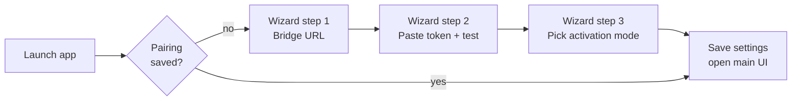
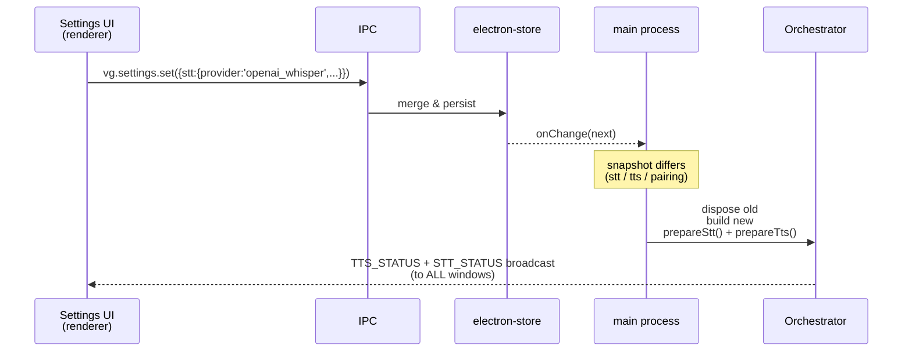

# Setup

End-to-end installation, from a fresh Hermes server to a working voice
conversation. Target: under five minutes from clone to first "hi
Hermes".

## Prerequisites

**Server (Linux):**
- `python3` ≥ 3.10 with the `venv` module (`apt install python3-venv` on
  Debian / Ubuntu — the installer offers to do this for you if it's
  missing).
- `systemd` (every mainstream distro from the last decade).
- The Hermes agent reachable on a local HTTP port (default
  `http://localhost:8642` — see [Hermes API server docs][api-docs]).
- Root, or a user with `sudo`.

[api-docs]: https://hermes-agent.nousresearch.com/docs/user-guide/features/api-server

**Desktop (macOS — only fully-tested platform today):**
- macOS 12 (Monterey) or newer for the Apple Silicon build; Intel works
  too but is built separately.
- Node.js ≥ 22 only required if you build from source. A pre-built
  `.dmg` is published per release.
- For wake-word activation: `python3` ≥ 3.10 with `openwakeword` and
  `sounddevice` (the runner ships these in
  [`resources/python/requirements.txt`](https://github.com/VivaldiCode/voice-gateway/blob/main/resources/python/requirements.txt)).
- For local Whisper: `whisper-cli` from
  [`brew install whisper-cpp`](https://formulae.brew.sh/formula/whisper-cpp)
  — the app auto-detects it on `$PATH` and downloads the GGML model the
  first time you press Talk.
- For local Piper: nothing — the app creates a Python venv at
  `~/Library/Application Support/Voice Gateway/piper/venv` and
  `pip install piper-tts` on first use.

For the gory details on how each of these is discovered or installed,
see [[Speech-To-Text]] and [[Text-To-Speech]].

## Step 1 — Install the bridge on your Hermes host

```bash
curl -fsSL https://raw.githubusercontent.com/VivaldiCode/voice-gateway/main/server/install.sh | bash
```

The script:

1. Re-execs itself under `sudo` (via a temp-file dance — see
   [[Hermes-Voice-Bridge#install-script]] for why a naive `sudo -E bash
   $0` doesn't work for piped installs).
2. Auto-installs `curl`, `git`, `python3`, and `python3-venv` if any are
   missing, prompting once per package via the host's package manager
   (`apt`, `dnf`, `pacman`, etc).
3. Prompts for:
   - **Bridge port** (default `8765`).
   - **Hermes API URL** (default `http://localhost:8642`).
   - **Hermes API key** — paste the bearer token your Hermes instance
     issues. Press Enter to skip if Hermes is unauthenticated.
4. Creates a system user `hermes-voice` (no shell), drops a Python
   virtualenv at `/opt/hermes-voice-bridge/venv`, generates a 32-byte
   pairing token, writes
   `/etc/hermes-voice-bridge/config.toml` (mode `0640`,
   `root:hermes-voice`), and enables a `systemd` unit
   `hermes-voice-bridge.service`.
5. Prints a banner with the pairing token and bridge URL.

The script is **idempotent**: re-running upgrades the Python package,
preserves the pairing token, and preserves the Hermes API key. Pass
`--yes` for unattended installs, `--port` / `--hermes-url` /
`--hermes-api-key` to skip individual prompts, or set the matching
`BRIDGE_PORT` / `HERMES_URL` / `HERMES_API_KEY` env vars.

```bash
# Unattended install for CI / packer:
HERMES_API_KEY=sk-... ASSUME_YES=1 \
  curl -fsSL https://raw.githubusercontent.com/VivaldiCode/voice-gateway/main/server/install.sh | sudo -E bash
```

### Verifying the bridge

```bash
systemctl status hermes-voice-bridge
journalctl -fu hermes-voice-bridge
curl http://localhost:8765/healthz   # → {"ok": true, "version": "0.1.0"}
```

The expected log line on every successful turn:

```
hermes responded 200 (Content-Type=text/event-stream)
hermes stream done — N delta(s), M chars total
```

See [[Troubleshooting]] for what each variant means.

### Adjusting the Hermes API shape

The bridge POSTs to `${hermes_base_url}/v1/chat/completions` in the
OpenAI Chat Completions format. If your Hermes is shaped differently,
edit
[`/opt/hermes-voice-bridge/src/hermes_voice_bridge/hermes_adapter.py`](https://github.com/VivaldiCode/voice-gateway/blob/main/server/hermes-voice-bridge/src/hermes_voice_bridge/hermes_adapter.py),
restart with `sudo systemctl restart hermes-voice-bridge`. Keep the
`async def stream_chat(...)` signature — everything else is yours to
change. See [[Hermes-Voice-Bridge#hermesadapter]] for the contract.

## Step 2 — Install the desktop app

**Easy path** — grab the latest pre-built DMG from
[releases](https://github.com/VivaldiCode/voice-gateway/releases).

**Build from source:**

```bash
git clone https://github.com/VivaldiCode/voice-gateway
cd voice-gateway
npm install
npm run build:mac       # writes release/*.dmg
open release/*.dmg
```

The build pipeline runs an `afterPack` hook that injects
`NSMicrophoneUsageDescription` into every helper Info.plist and
ad-hoc-signs the bundle with the hardened runtime. See
[[Build-And-Packaging]] for why all of that is necessary on
unsigned builds.

## Step 3 — First run

Opening the freshly-installed app drops you into the **first-run
pairing wizard**:



1. **Where is your Hermes?** Paste the bridge URL printed by
   `install.sh`. The wizard validates the protocol prefix locally
   (`ws://` or `wss://`).
2. **Paste the pairing token.** Click **Test connection** — the renderer
   asks the main process to open a WebSocket, send `hello`, and confirm
   it gets `welcome` back. The button only lights green when that
   roundtrip succeeds. Bad tokens map to a friendly "the token wasn't
   accepted" message (see
   [`testPairing`](https://github.com/VivaldiCode/voice-gateway/blob/main/src/main/ipc-handlers.ts)
   for the full error mapping).
3. **How do you want to talk?** Two cards:
   - **Push-to-talk button** (recommended) — the mic only opens while
     you hold the on-screen button or press the global hotkey (default
     `Cmd+Shift+H` / `Ctrl+Shift+H`).
   - **Always listening (wake word)** — passive listening using
     [openWakeWord][oww]. Pick a wake word from the list.

[oww]: https://github.com/dscripka/openWakeWord

Click **Done!** → **Open Voice Gateway**.

## Step 4 — Say something

Hold the round purple button (or press the hotkey), speak, release. The
[[State-Machine|state orb]] cycles:

```
IDLE → CAPTURING → STREAMING → THINKING → SPEAKING → IDLE
       (green)     (yellow)     (yellow)   (purple)
```

The transcript view shows your words and the assistant's reply as they
arrive. While the assistant is talking you can **barge in** — pressing
the button again immediately cancels playback and opens the mic for a
new turn.

## Step 5 — Tune via Settings

The **Definições** window (separate `BrowserWindow` opened by the gear
icon) has six tabs:

| Tab | What it controls |
|---|---|
| **Voz** | TTS provider (Piper / ElevenLabs), voice picker, voice-test textarea (type any phrase to hear it spoken) |
| **Microfone** | Input device picker, macOS permission diagnostic, live VU meter |
| **Reconhecimento** | STT provider, Whisper model size, language, OpenAI key |
| **Ativação** | PTT vs wake word, hotkey, **minimum audio length** (filters accidental taps before they hit STT) |
| **Conexão** | Re-pair with a different bridge |
| **Avançado** | Factory reset |

Full reference: [[Renderer-UI#settingspanel]].

## Wake-word mode

Wake-word runs the Python script at
[`resources/python/wake_word_runner.py`](https://github.com/VivaldiCode/voice-gateway/blob/main/resources/python/wake_word_runner.py)
as a child process. The script opens the microphone itself via
`sounddevice`, runs `openwakeword` over 80 ms 16 kHz frames, and writes
JSON lines to stdout. See [[Wake-Word-Detection]] for the deep dive.

If the Voice Gateway icon in the system tray turns green, the detector
is alive. If you see *"Could not start the detector"*, install the
runner's dependencies manually:

```bash
python3 -m pip install -r resources/python/requirements.txt
```

## Switching providers without a relaunch

Changing **STT provider** (Whisper local ↔ OpenAI), **TTS provider**
(Piper ↔ ElevenLabs), or the **pairing** triggers a live rebuild of the
[[Conversation-Orchestrator]] in the main process:



This is implemented in
[`src/main/index.ts`](https://github.com/VivaldiCode/voice-gateway/blob/main/src/main/index.ts)
under `settings.onChange(...)`. See [[Conversation-Orchestrator#lifecycle]].

## Next steps

- Curious why a turn sometimes ends in silence? → [[Troubleshooting]]
- Want to add an STT/TTS provider? → [[Speech-To-Text]] / [[Text-To-Speech]]
- Want to extend the protocol with a new event? → [[Protocol]]
