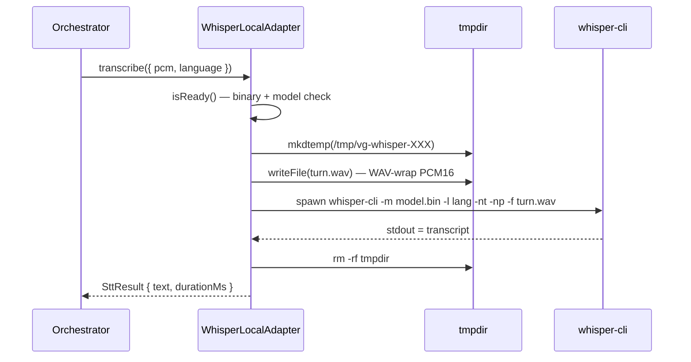

# Speech-To-Text

STT lives behind a single interface so the orchestrator doesn't care
whether transcription happens on-device or in the cloud:

```ts
interface SttAdapter {
  readonly id: string;
  isReady(): Promise<boolean>;
  prepare(onProgress?: (p: ProgressEvent) => void): Promise<void>;
  transcribe(req: SttRequest): Promise<SttResult>;
}
```

Implementations:

| `id`              | Class                      | Latency | Cost | Online required |
|-------------------|----------------------------|---------|------|-----------------|
| `whisper_local`   | `WhisperLocalAdapter`      | 1–5 s   | free | no              |
| `openai_whisper`  | `OpenAIWhisperAdapter`     | ~1 s    | $$   | yes             |

Source:
[`src/main/services/stt-service.ts`](https://github.com/VivaldiCode/voice-gateway/blob/main/src/main/services/stt-service.ts).
Tests:
[`tests/integration/stt-service.test.ts`](https://github.com/VivaldiCode/voice-gateway/blob/main/tests/integration/stt-service.test.ts).

## The factory

```ts
export function createSttAdapter(
  settings: SttSettings,
  opts: CreateSttOptions = {},
): SttAdapter {
  if (settings.provider === 'openai_whisper') {
    return new OpenAIWhisperAdapter({
      apiKey: settings.openai.apiKey,
      model: settings.openai.model,
    });
  }
  return new WhisperLocalAdapter({
    config: settings.whisperLocal,
    autoInstall: opts.autoInstall ?? false,
  });
}
```

Called by `bootstrapConversation()` in
[`src/main/index.ts`](https://github.com/VivaldiCode/voice-gateway/blob/main/src/main/index.ts)
with `autoInstall: true` so a fresh macOS install can bootstrap itself
on first use.

## Whisper local (whisper.cpp)

### Binary discovery

Looks for the binary in this order:

1. `<userData>/whisper/bin/whisper` — a path we control (future use:
   ship a self-contained binary).
2. PATH: `whisper-cli` → `whisper-cpp` → `whisper` (in order). The
   first hit wins.

```ts
const WHISPER_BINARY_CANDIDATES = ['whisper-cli', 'whisper-cpp', 'whisper'];
```

Why three names? `whisper-cli` is the Homebrew-current name (as of
whisper-cpp 1.6+), `whisper-cpp` is the legacy alias kept for
backwards-compat, and `whisper` is what users hit when they build from
source with `cmake`.

### Auto-install on macOS

If autoInstall is on, the binary is missing, and we're on Darwin with
`brew` on PATH, we run:

```bash
brew install whisper-cpp
```

The stdout/stderr is captured to `electron-log`; on failure we surface
a friendly Portuguese message pointing the user at the manual install.

### Model download

Models live at `<userData>/whisper/models/ggml-<size>.bin`. If missing,
we download from Hugging Face:

```ts
const WHISPER_MODEL_URLS: Record<string, string> = {
  tiny: 'https://huggingface.co/ggerganov/whisper.cpp/resolve/main/ggml-tiny.bin',
  base: 'https://huggingface.co/ggerganov/whisper.cpp/resolve/main/ggml-base.bin',
  small: 'https://huggingface.co/ggerganov/whisper.cpp/resolve/main/ggml-small.bin',
};
```

Sizes:

| Model | File | Real-time factor on M1 Pro |
|-------|------|----------------------------|
| tiny  | 75 MB | ~0.1× (super fast)        |
| base  | 142 MB | ~0.2× (default)          |
| small | 466 MB | ~0.4× (best accuracy)    |

Progress is reported via the `onProgress` callback up the chain to
`vg:stt:progress`, which the Settings UI renders as a progress bar.

### Transcription flow



Why a temp file? `whisper-cli` reads from a file (no stdin support).
The `-nt` flag suppresses timestamps, `-np` suppresses the chatty
progress log on stderr so we only get the actual transcription on
stdout.

`pcm16ToWav()` is a 44-byte RIFF header + the raw PCM samples — zero
external deps, exported from the same module for tests.

### Error surfaces

Non-zero exit code captures the last 300 chars of stderr in the error
message:

```ts
reject(new Error(`whisper.cpp falhou (código ${code}): ${tail || '(sem stderr)'}`));
```

The orchestrator catches this, dispatches `ERROR` to the FSM, and emits
`error` to the renderer — the user sees a red orb with the actual
whisper output, copyable.

## OpenAI Whisper (cloud)

Simpler: WAV-wrap → multipart upload → JSON response.

```ts
const wav = pcm16ToWav(req.pcm, 16_000);
const form = new FormData();
form.append('file', new Blob([wav], { type: 'audio/wav' }), 'speech.wav');
form.append('model', this.model);                       // 'whisper-1'
form.append('response_format', 'json');
if (req.language !== 'auto') form.append('language', req.language);

const res = await this.fetchImpl(this.endpoint, {
  method: 'POST',
  headers: { Authorization: `Bearer ${this.apiKey}` },
  body: form,
});
```

`isReady()` is just `apiKey.trim().length > 0` — there's no model to
download, no binary to install.

The endpoint and fetch are both injectable so tests can intercept
without a real network call.

## Adding a new STT provider

1. Implement `SttAdapter` (4 methods).
2. Add a discriminant value to `SttProvider` in
   [`src/shared/types.ts`](https://github.com/VivaldiCode/voice-gateway/blob/main/src/shared/types.ts).
3. Wire it in `createSttAdapter()`.
4. Add a card to the **Reconhecimento** tab in
   [`SettingsPanel.tsx`](https://github.com/VivaldiCode/voice-gateway/blob/main/src/renderer/components/SettingsPanel.tsx).
5. Add a test in
   [`tests/integration/stt-service.test.ts`](https://github.com/VivaldiCode/voice-gateway/blob/main/tests/integration/stt-service.test.ts)
   with a fake transcript and assert the round-trip.

The adapter only needs to handle the `pcm: Buffer + language: 'auto' |
'pt' | 'en'` request shape. Everything else (WAV wrapping, language
mapping, prepare progress) is up to the implementation.

## How the orchestrator uses it

```ts
// src/main/services/conversation-orchestrator.ts
const r = await this.stt.transcribe({
  pcm: audio,
  language: (this.currentLang === 'auto' ? 'auto' : this.currentLang) as 'auto' | 'en' | 'pt',
});
transcript = r.text;
```

`currentLang` comes from `settings.stt.language`. On error we dispatch
`ERROR(STT_FAILED, message)`. If the transcript is empty after
trimming, we short-circuit back to IDLE without bothering Hermes.

See [[Conversation-Orchestrator#finishCurrentTurn]] for the full flow
including the `minAudioMs` short-capture filter that runs **before**
STT — accidental taps never even allocate a temp file.
