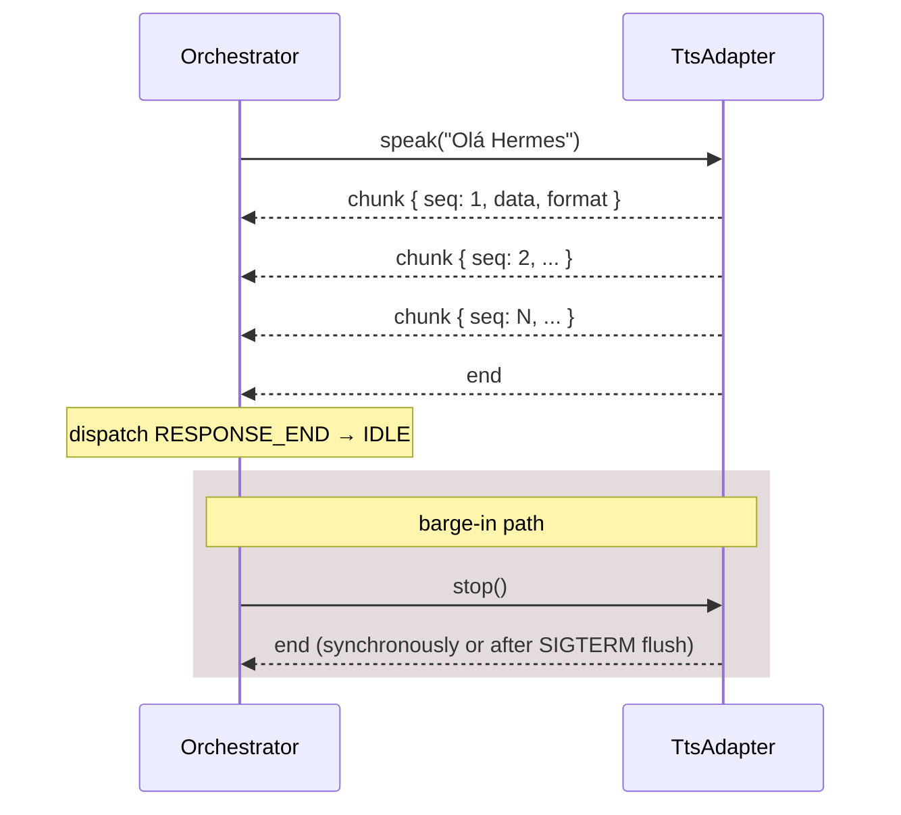

# Text-To-Speech

TTS mirrors the [[Speech-To-Text|STT]] design: a single adapter
interface, two implementations, a factory.

```ts
interface TtsAdapter extends EventEmitter {
  readonly id: string;
  isReady(): Promise<boolean>;
  prepare?(onProgress?: (p: TtsProgressEvent) => void): Promise<void>;
  speak(text: string): Promise<void>;
  stop(): void;

  on('chunk', cb: (c: TtsChunk) => void): void;
  on('end', cb: () => void): void;
  on('error', cb: (err: Error) => void): void;
}
```

| `id`            | Class                | Format         | Local? | Notes                              |
|-----------------|----------------------|----------------|--------|------------------------------------|
| `piper_local`   | `PiperAdapter`       | `pcm16_22050`  | yes    | Auto-installs via Python venv      |
| `elevenlabs`    | `ElevenLabsAdapter`  | `mp3`          | no     | API key required                   |

Source:
[`src/main/services/tts-service.ts`](https://github.com/VivaldiCode/voice-gateway/blob/main/src/main/services/tts-service.ts).
Tests:
[`tests/integration/tts-service.test.ts`](https://github.com/VivaldiCode/voice-gateway/blob/main/tests/integration/tts-service.test.ts).

## The chunk shape

```ts
interface TtsChunk {
  data: Buffer;
  format: TtsAudioFormat;          // 'pcm16_22050' | 'mp3'
  seq: number;                     // monotonic per-utterance counter
}
```

Adapters emit `chunk` events as audio becomes available, then exactly
one `end` event when the utterance finishes (proc closes / stream
done). The orchestrator forwards `chunk` to the renderer via
`vg:conv:tts-chunk`; the renderer's [[Audio-Pipeline|`AudioPlayback`]]
schedules each chunk.

`seq` is mostly diagnostic — playback uses arrival order — but it makes
"chunk 7 of N" log lines actionable when debugging stutters.

## Piper (local, default)

Piper is a fast neural TTS that runs on CPU. It ships as a Python
package; we isolate it in a venv inside `<userData>/piper/venv` so we
don't pollute the user's system Python.

### Layout

```
<userData>/piper/
├── venv/                  # python -m venv
│   └── bin/piper          # the binary we spawn
└── voices/
    ├── en_US-lessac-medium.onnx        # 60 MB model
    └── en_US-lessac-medium.onnx.json   # 4 KB metadata
```

### Binary discovery

```ts
const PIPER_BINARY_CANDIDATES = ['piper', 'piper-tts'];

async discoverBinary(): Promise<string | null> {
  // 1. <userData>/piper/bin/piper (our managed venv)
  // 2. PATH lookup for 'piper', then 'piper-tts'
}
```

### Auto-install: the venv dance

The user's first `prepare()` call (triggered by `bootstrapConversation`
in [`src/main/index.ts`](https://github.com/VivaldiCode/voice-gateway/blob/main/src/main/index.ts))
creates the venv from scratch if no binary was found:

```ts
private async tryAutoInstall(onProgress?): Promise<string | null> {
  const venvDir = join(safeUserDataPath(), 'piper', 'venv');
  const venvBin = join(venvDir, 'bin', binaryName());

  const python3 = await this.whichImpl('python3');
  if (!python3) return null;

  await fs.rm(venvDir, { recursive: true, force: true });   // recover from half-built
  await this.runProcess(python3, ['-m', 'venv', venvDir]);

  const venvPip = join(venvDir, 'bin', 'pip');
  await this.runProcess(venvPip, ['install', '--quiet', '--upgrade', 'pip', 'wheel']);
  await this.runProcess(venvPip, ['install', '--quiet', '--upgrade', 'piper-tts']);

  return (await fs.access(venvBin)) ? venvBin : null;
}
```

Why a venv and not `pip install --user piper-tts`? Because piper-tts
pulls in `onnxruntime` and `numpy` versions that frequently collide
with whatever the user already has globally. A self-contained venv
keeps every install reproducible.

Why no Homebrew formula? There isn't one. PyPI is the canonical
distribution channel for piper-tts.

### Voice download

Voices are `.onnx` (model) + `.onnx.json` (phoneme/inference config)
pairs hosted on Hugging Face. The download URL for `en_US-lessac-medium`
is built in
[`src/shared/piper-voices.ts → piperVoiceFileUrl()`](https://github.com/VivaldiCode/voice-gateway/blob/main/src/shared/piper-voices.ts):

```
https://huggingface.co/rhasspy/piper-voices/resolve/main/en/en_US/lessac/medium/en_US-lessac-medium.onnx
```

Both files are required for inference. We download `.onnx` first
(progress visible), then `.onnx.json` (small, no progress).

### Speaking

Piper reads text from stdin and writes raw PCM16 mono @ 22 050 Hz to
stdout:

```ts
const args = [
  '--model', this.modelPath(),
  '--output-raw',
  '--sentence-silence', '0.2',
];
const proc = this.spawnImpl(bin, args, { stdio: ['pipe', 'pipe', 'pipe'] });

proc.stdout?.on('data', (b: Buffer) => {
  this.seq += 1;
  this.emit('chunk', { data: b, format: 'pcm16_22050', seq: this.seq });
});
proc.on('close', (code) => {
  if (code === 0 || code === null) this.emit('end');
  else this.emit('error', new Error(`piper saiu com código ${code}`));
});

proc.stdin?.end(`${text}\n`);
```

Closing stdin tells Piper "no more text" — the process exits cleanly
once it's flushed its last chunk.

`--sentence-silence 0.2` adds 200 ms of silence between sentences. The
default is jarringly fast; this matches human pacing.

### Stop / barge-in

```ts
stop(): void {
  if (this.current) {
    this.current.kill('SIGTERM');
    this.current = null;
  }
}
```

SIGTERM lets Piper flush whatever's in its output buffer and exit
cleanly. The orchestrator clears `pendingTtsTurnId` **before** calling
`stop()` (see [[Conversation-Orchestrator#barge-in]]) so late chunks
from the dying process are silently dropped.

## ElevenLabs (cloud)

A single HTTPS streaming request returns MP3 over chunked transfer
encoding. We forward each chunk as a `TtsChunk` with `format: 'mp3'`;
the renderer buffers them and runs `decodeAudioData` once on
`endUtterance()`.

```ts
const res = await this.fetchImpl(this.endpoint(this.config.voiceId), {
  method: 'POST',
  headers: {
    'xi-api-key': this.config.apiKey,
    'Content-Type': 'application/json',
    Accept: 'audio/mpeg',
  },
  body: JSON.stringify({
    text,
    model_id: this.config.modelId,            // 'eleven_turbo_v2_5'
    voice_settings: { stability: 0.45, similarity_boost: 0.75 },
  }),
  signal: controller.signal,
});

const reader = res.body.getReader();
for (;;) {
  const { done, value } = await reader.read();
  if (done) break;
  this.seq += 1;
  this.emit('chunk', { data: Buffer.from(value), format: 'mp3', seq: this.seq });
}
this.emit('end');
```

Default endpoint:

```
POST https://api.elevenlabs.io/v1/text-to-speech/<voiceId>/stream?output_format=mp3_44100_128
```

The `output_format` query parameter is significant — it controls the
sample rate / bitrate of the returned MP3. We use 44.1 kHz / 128 kbps
as the sweet spot between quality and latency.

Stop is implemented via `AbortController`:

```ts
stop(): void {
  this.controller?.abort();
  this.controller = null;
}
```

The fetch rejects with `AbortError`, which we treat as a clean `end`
event (not an error):

```ts
if ((err as Error).name === 'AbortError') {
  this.emit('end');
  return;
}
```

### Listing voices

The Settings UI uses
[`listElevenLabsVoices()`](https://github.com/VivaldiCode/voice-gateway/blob/main/src/main/ipc-handlers.ts)
to populate the voice picker. It hits
`GET https://api.elevenlabs.io/v1/voices` with the user's `xi-api-key`,
extracts `voice_id`, `name`, language label, and preview URL. A 401
maps to "A chave da ElevenLabs foi rejeitada (401)" so the user doesn't
have to grok HTTP codes.

## Factory

```ts
export function createTtsAdapter(
  settings: TtsSettings,
  opts: CreateTtsOptions = {},
): TtsAdapter {
  if (settings.provider === 'elevenlabs') {
    return new ElevenLabsAdapter({ config: settings.elevenlabs });
  }
  return new PiperAdapter({
    config: settings.piper,
    autoInstall: opts.autoInstall ?? false,
  });
}
```

Called from
[`bootstrapConversation()`](https://github.com/VivaldiCode/voice-gateway/blob/main/src/main/index.ts).
On every settings change to `tts.*`, the orchestrator is rebuilt and a
fresh adapter is constructed — the old Piper process (if any) is
killed by its `stop()` during dispose.

## Adapter event diagram



## Test surface

[`tests/integration/tts-service.test.ts`](https://github.com/VivaldiCode/voice-gateway/blob/main/tests/integration/tts-service.test.ts)
uses a fake `spawn` and fake `fetch` so:

- Piper's chunked stdout maps to chunk events.
- Piper's non-zero exit maps to an error event.
- Piper's missing binary triggers the auto-install path (mocked).
- ElevenLabs' streaming body produces ordered MP3 chunks.
- ElevenLabs' 401 surfaces a friendly error.
- `stop()` aborts the in-flight fetch / kills the process.

## Adding a new TTS provider

1. Implement `TtsAdapter` (extends `EventEmitter`).
2. Add the new format to `TtsAudioFormat` if it isn't `pcm16_*` or `mp3`.
3. Teach `AudioPlayback` how to decode it (see [[Audio-Pipeline]]).
4. Add to `createTtsAdapter()` and `TtsProvider` discriminant.
5. Add Settings UI in **Voz** tab and a test in
   `tests/integration/tts-service.test.ts`.
