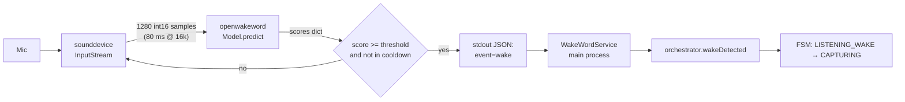

# Wake-Word Detection

Wake-word activation is opt-in. When enabled, a Python child process
listens on the system microphone continuously, runs
[openWakeWord](https://github.com/dscripka/openWakeWord) over 80 ms
frames, and emits a single JSON line per detection that the main
process turns into an `orchestrator.wakeDetected()` call.



## The Python runner

Source:
[`resources/python/wake_word_runner.py`](https://github.com/VivaldiCode/voice-gateway/blob/main/resources/python/wake_word_runner.py).

A 100-line script that:

1. Imports `numpy`, `sounddevice`, `openwakeword`. Any `ImportError`
   here is reported via `{"event": "error", "message": "missing dependency: ..."}`
   and the process exits with code 2.
2. Loads the model(s) specified via repeated `--model` arguments.
3. Emits `{"event": "ready", "models": [...]}` to stdout.
4. Opens a `sounddevice.InputStream(samplerate=16000, channels=1, dtype='int16', blocksize=1280)`.
5. In a tight loop, reads 80 ms frames, runs `model.predict(frame)`,
   filters scores above the threshold (default 0.5), and emits
   `{"event": "wake", "model": "<name>", "score": 0.78, "ts": <epoch>}`.
6. Honours a per-model cooldown (default 1.5 s) so a single utterance
   doesn't fire 5 times in a row.

Stdout is **always JSON Lines**. Stderr is human diagnostics (PortAudio
warnings, etc) and is piped to electron-log at debug level.

CLI surface:

```
wake_word_runner.py --model NAME ...  # one or more models, repeatable
                    --threshold 0.5
                    --cooldown 1.5
                    --samplerate 16000
                    --chunk 1280       # 80 ms @ 16k
```

## The Node supervisor

Source:
[`src/main/services/wake-word-service.ts`](https://github.com/VivaldiCode/voice-gateway/blob/main/src/main/services/wake-word-service.ts).

Spawns the Python script, reads stdout line-by-line with a `readline`
interface, parses each line as JSON, and emits typed events:

```ts
export interface WakeWordServiceEvents {
  ready: (models: string[]) => void;
  wake:  (model: string, score: number) => void;
  error: (message: string) => void;
  exit:  (code: number | null) => void;
}
```

```ts
start(model: WakeWord, threshold = 0.5): void {
  const proc = this.spawnImpl(
    this.pythonExe,                          // 'python3'
    [this.scriptPath, '--model', model, '--threshold', String(threshold)],
    { stdio: ['ignore', 'pipe', 'pipe'] },
  );
  const lines = createInterface({ input: proc.stdout });
  lines.on('line', (line) => this.handleLine(line));
  proc.stderr?.on('data', (b) => log.debug('[VG] wake-word:', b.toString().trim()));
  proc.on('exit', (code) => this.emit('exit', code));
}
```

`handleLine` validates the JSON shape (must be `{ event: string }`) and
ignores anything malformed — protects against half-flushed lines on
process shutdown.

## Default script path

In packaged builds, the Python script is extracted by electron-builder
into `Contents/Resources/python/wake_word_runner.py`:

```ts
function defaultScriptPath(): string {
  if (app.isPackaged) {
    return join(process.resourcesPath, 'python', 'wake_word_runner.py');
  }
  return join(process.cwd(), 'resources', 'python', 'wake_word_runner.py');
}
```

The `extraResources` config in
[`electron-builder.yml`](https://github.com/VivaldiCode/voice-gateway/blob/main/electron-builder.yml)
includes `resources/python/**/*` — see [[Build-And-Packaging]].

## Dependency installation

The runner depends on `numpy`, `sounddevice`, and `openwakeword`,
listed in
[`resources/python/requirements.txt`](https://github.com/VivaldiCode/voice-gateway/blob/main/resources/python/requirements.txt).

We don't auto-install these on first use (Piper does because it's
isolated in its own venv; openwakeword needs system-wide audio
drivers). The Settings UI shows "Não consegui iniciar o detector" if
the import fails, with a copyable terminal command:

```bash
python3 -m pip install -r resources/python/requirements.txt
```

In practice users either have a global Python with these libs or they
install once and forget.

## Integration with the orchestrator

`bootstrapConversation` builds the `WakeWordService` lazily, only when
`activation.mode === 'WAKE_WORD'`:

```ts
function rebuildWakeWord(): void {
  wake?.stop();
  wake = null;
  const s = settings.get();
  if (s.activation.mode !== 'WAKE_WORD') return;
  if (!orchestrator) return;
  wake = new WakeWordService();
  wake.on('wake', (model) => {
    log.info('[VG] wake detected:', model);
    orchestrator?.wakeDetected();
  });
  wake.on('error', (msg) => send(IPC.WAKE_STATUS, { running: false, error: msg }));
  wake.on('ready', (models) => send(IPC.WAKE_STATUS, { running: true, models }));
  wake.start(s.activation.wakeWord, 0.5);
}
```

`orchestrator.wakeDetected()` dispatches the `WAKE_DETECTED` FSM event,
which transitions `LISTENING_WAKE → CAPTURING`. From there the flow is
identical to push-to-talk except `pttRelease()` is replaced by a VAD
silence event (the VAD path is currently a stub — see
[[State-Machine#events]]).

## Supported wake words

The list in
[`src/shared/constants.ts`](https://github.com/VivaldiCode/voice-gateway/blob/main/src/shared/constants.ts):

```ts
export const SUPPORTED_WAKE_WORDS = [
  'hey_jarvis',
  'alexa',
  'hey_mycroft',
  'hey_rhasspy',
  'computer',
] as const;
```

These correspond to model names bundled with openWakeWord. To support
a custom wake word, you'd add the model to openWakeWord's model cache
and extend this array.

## Tray status

The system tray (see
[`src/main/tray.ts`](https://github.com/VivaldiCode/voice-gateway/blob/main/src/main/tray.ts))
listens to `vg:wake:status` and tints its icon green when the runner
is alive — so a user with wake mode on but the detector dead doesn't
get silent failure. The error message is shown in the tray tooltip.

## Testing

[`tests/integration/wake-word-service.test.ts`](https://github.com/VivaldiCode/voice-gateway/blob/main/tests/integration/wake-word-service.test.ts)
uses a fake `spawn` that emits JSON Lines on its fake stdout. It
asserts:

- `ready` event with the models list,
- `wake` event with model+score,
- malformed JSON lines are ignored,
- proc exit propagates as `exit`,
- `stop()` sends SIGTERM.

The Python script itself is exercised end-to-end in the Playwright E2E
suite when wake mode is selected.
