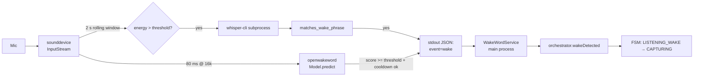
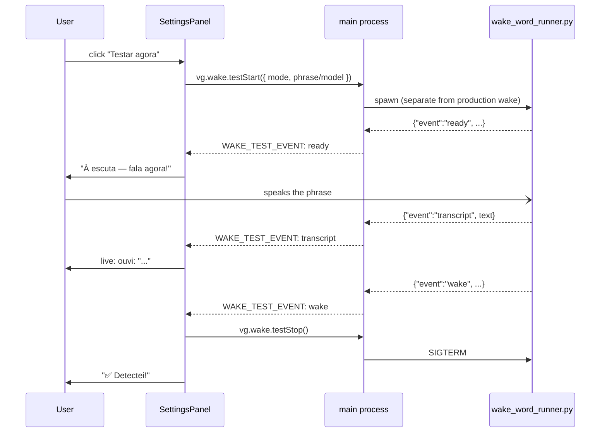

# Wake-Word Detection

Wake-word activation is opt-in. When enabled, a Python child process
listens on the system microphone continuously and emits a single JSON
line per detection that the main process turns into an
`orchestrator.wakeDetected()` call.

Two operating modes:

| Mode      | Detector              | CPU cost  | Phrase freedom                 |
|-----------|-----------------------|-----------|--------------------------------|
| `openww`  | openWakeWord pretrained | low      | Fixed list (hey_jarvis, alexa, computer, hey_mycroft, hey_rhasspy) |
| `phrase`  | streaming whisper.cpp | medium    | Any user-typed phrase (e.g. "hey hermes", "olá computador") |



Source:
[`resources/python/wake_word_runner.py`](https://github.com/VivaldiCode/voice-gateway/blob/main/resources/python/wake_word_runner.py),
[`resources/python/wake_phrase.py`](https://github.com/VivaldiCode/voice-gateway/blob/main/resources/python/wake_phrase.py),
[`src/main/services/wake-word-service.ts`](https://github.com/VivaldiCode/voice-gateway/blob/main/src/main/services/wake-word-service.ts),
[`src/shared/wake-phrase.ts`](https://github.com/VivaldiCode/voice-gateway/blob/main/src/shared/wake-phrase.ts).

## The Python runner

A single script with two dispatch paths via `--mode`:

```
wake_word_runner.py --mode openww --model NAME [--model NAME ...]
                    --threshold 0.5
                    --cooldown 1.5

wake_word_runner.py --mode phrase
                    --phrase "hey hermes"
                    --whisper-bin /path/to/whisper-cli
                    --whisper-model /path/to/ggml-base.bin
                    --language pt
                    --window-ms 2000
                    --hop-ms 800
                    --energy-threshold 0.005
                    --cooldown 1.5
```

Stdout is **always JSON Lines**:

```
{"event": "ready", "models": ["hey_jarvis"]}          # openww
{"event": "ready", "phrase": "hey hermes"}            # phrase
{"event": "wake", "model": "hey_jarvis", "score": 0.78, "ts": ...}
{"event": "wake", "phrase": "hey hermes", "transcript": "Hey Hermes!", "ts": ...}
{"event": "transcript", "text": "...", "ts": ...}     # phrase mode only
{"event": "error", "message": "..."}
```

### openWakeWord path

Loads one or more pre-trained models, runs `model.predict(frame)` over
80 ms (1280 samples @ 16 kHz) windows, fires a `wake` event for each
score above `--threshold`. Honours per-model `--cooldown` so one
utterance doesn't fire 5 times in a row.

### Phrase path

Runs a basic energy gate so we don't transcribe silence, then calls
`whisper-cli` as a subprocess on overlapping 2 s windows. The
transcript is normalised via `matches_wake_phrase` (see below) and
compared against the user's typed phrase. The energy gate keeps CPU
usage manageable (Whisper inference is skipped on quiet windows).

## Phrase normalisation

`src/shared/wake-phrase.ts` (TS) and
`resources/python/wake_phrase.py` (Python) implement the **same**
matcher. The contract is enforced by two test suites:

- [`tests/unit/wake-phrase.test.ts`](https://github.com/VivaldiCode/voice-gateway/blob/main/tests/unit/wake-phrase.test.ts) — 23 vitest cases.
- [`resources/python/tests/test_wake_phrase.py`](https://github.com/VivaldiCode/voice-gateway/blob/main/resources/python/tests/test_wake_phrase.py) — 18 pytest cases, mirrors of the TS suite.

Normalisation rules (both sides):

1. Lowercase via the language's standard `lower()` / `toLowerCase()`.
2. NFD-decompose, then strip combining marks (so "olá" → "ola"). Whisper
   isn't consistent with diacritics; we strip on both sides.
3. Drop ASCII punctuation (`.`, `,`, `?`, `!`, parens, quotes, etc.).
4. Collapse runs of whitespace to a single space.

Matching is a substring check after normalisation. Phrases shorter
than `MIN_WAKE_PHRASE_CHARS` (3) are rejected by the UI's
`validateWakePhrase` AND the runtime matcher as a defence-in-depth
against accidental phrases like "oi" that match background-noise
transcripts.

## The Node supervisor

`WakeWordService` (TS) spawns the runner and translates its JSON-line
output into typed `EventEmitter` events:

```ts
export interface WakeWordServiceEvents {
  ready: (info: { models?: string[]; phrase?: string }) => void;
  wake:  (info: { model?: string; phrase?: string; score?: number; transcript?: string }) => void;
  transcript: (text: string) => void;      // phrase mode only
  error: (message: string) => void;
  exit:  (code: number | null) => void;
}
```

`start(params)` dispatches on `params.mode`:

```ts
type WakeStartParams =
  | { mode: 'openww'; model: WakeWord; threshold?: number }
  | { mode: 'phrase'; phrase: string; whisperBin: string; whisperModel: string; language?: string; cooldownSec?: number };
```

## Auto-install of Python deps

The runner needs `openwakeword`, `sounddevice`, and `numpy`. On a fresh
macOS install none of those are present by default. To remove the
"open a terminal and run pip" friction, `WakeWordService.resolvePython()`
tries this ladder:

1. The explicit `pythonExe` option, if passed by tests.
2. A cached venv at `<userData>/wake/venv/bin/python`, if it exists.
3. **Auto-install**: build a fresh venv at the same path and
   `pip install -r requirements.txt`. This mirrors the
   [[Text-To-Speech#auto-install-the-venv-dance|Piper venv pattern]] and
   isolates the runner's deps from the system Python.
4. Fall back to `python3` on PATH (legacy path — works if the user
   already installed openwakeword globally).

The venv is rebuilt from scratch on every `buildVenv()` call so a
half-built install from a previous aborted attempt gets cleaned up.

## Integration with the orchestrator

`bootstrapConversation` builds the `WakeWordService` lazily, only when
`activation.mode === 'WAKE_WORD'`. `rebuildWakeWord` dispatches on
`activation.wakeMode`:

```ts
if (s.activation.wakeMode === 'phrase') {
  const paths = await resolveWhisperPathsForWake();
  if (!paths.ok) { send(IPC.WAKE_STATUS, { running: false, error: paths.reason }); return; }
  await wake.start({ mode: 'phrase', phrase: s.activation.wakePhrase, ...paths });
} else {
  await wake.start({ mode: 'openww', model: s.activation.wakeWord, threshold: 0.5 });
}
```

`resolveWhisperPathsForWake()` looks up the local whisper-cli binary +
model file (reusing
[`WhisperLocalAdapter.resolveBinaryPath()`](https://github.com/VivaldiCode/voice-gateway/blob/main/src/main/services/stt-service.ts)
and `resolveModelPath()`). On missing binary or missing model, the
user sees a friendly hint in the status pill.

When the runner emits `wake`, the orchestrator dispatches
`WAKE_DETECTED` to the FSM, which transitions `LISTENING_WAKE →
CAPTURING`. From there the flow is identical to push-to-talk except
`pttRelease()` is replaced by a VAD silence event (the VAD path is
currently a stub).

## The "Testar agora" button

A second `WakeWordService` instance — `testWake` — backs the Settings
→ Ativação test button:



The renderer auto-stops the test after 20 s if nothing fires so we
never leak a runner. Switching modes / phrase mid-test stops the
current runner before starting a new one. Implementation:
[`SettingsPanel.tsx → WakeTester`](https://github.com/VivaldiCode/voice-gateway/blob/main/src/renderer/components/SettingsPanel.tsx).

## Default script + venv paths

In packaged builds, both Python files are extracted by electron-builder
into `Contents/Resources/python/`:

```
Contents/Resources/python/
├── wake_word_runner.py
├── wake_phrase.py            ← imported by the runner
└── requirements.txt          ← used by the auto-installer
```

The runner adds its own dirname to `sys.path` at import time so the
sibling `wake_phrase` module resolves both in dev (running from
`resources/python/`) and in production (running from
`Contents/Resources/python/`).

The venv goes to `<userData>/wake/venv` — same parent dir scheme as
Piper's venv. macOS: `~/Library/Application Support/Voice Gateway/wake/venv`.

## Supported wake words (openww mode)

```ts
export const SUPPORTED_WAKE_WORDS = [
  'hey_jarvis',
  'alexa',
  'hey_mycroft',
  'hey_rhasspy',
  'computer',
] as const;
```

These correspond to models bundled with openWakeWord. For anything
outside this list, switch to **Frase personalizada** in Settings →
Ativação.

## Tray status

The system tray
([`src/main/tray.ts`](https://github.com/VivaldiCode/voice-gateway/blob/main/src/main/tray.ts))
listens to `vg:wake:status` and tints its icon green when the runner
is alive — so a user with wake mode on but the detector dead doesn't
get silent failure. The error message is shown in the tray tooltip.

## Testing

| File | Coverage |
|---|---|
| [`tests/unit/wake-phrase.test.ts`](https://github.com/VivaldiCode/voice-gateway/blob/main/tests/unit/wake-phrase.test.ts) | 23 cases: normalisation, validation bounds, matcher edge cases |
| [`resources/python/tests/test_wake_phrase.py`](https://github.com/VivaldiCode/voice-gateway/blob/main/resources/python/tests/test_wake_phrase.py) | 18 cases: pytest mirror of the TS suite — keeps the two implementations aligned |
| [`resources/python/tests/test_runner_helpers.py`](https://github.com/VivaldiCode/voice-gateway/blob/main/resources/python/tests/test_runner_helpers.py) | 11 cases: WAV-wrap layout, energy RMS, sliding window |
| [`tests/integration/wake-word-service.test.ts`](https://github.com/VivaldiCode/voice-gateway/blob/main/tests/integration/wake-word-service.test.ts) | 12 cases: both modes spawn the right args, parse JSON lines, handle SIGTERM, propagate errors, python resolution |

Run them with `npm test` (TS), `pytest resources/python/tests` (Python
runner helpers), and `pytest server/hermes-voice-bridge/tests` (bridge).
