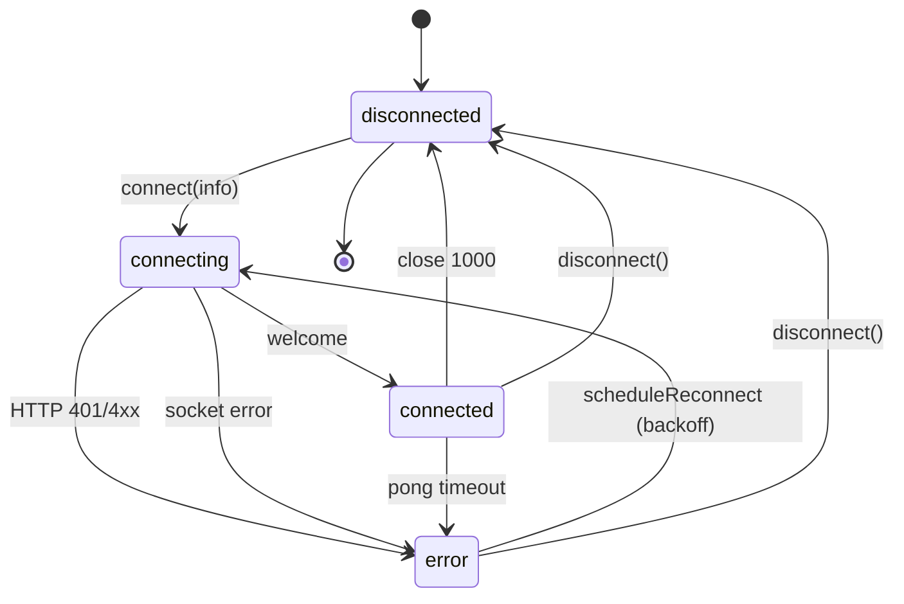

# WebSocket Client

`HermesClient` is the long-lived, single-instance WebSocket connection
to the [[Hermes-Voice-Bridge]]. It handles:

- the authenticated upgrade,
- the `hello` / `welcome` handshake,
- heartbeat ping/pong with latency tracking,
- exponential-backoff reconnect with sticky disconnect,
- the binary-after-header framing for audio,
- typed message parsing via [[Protocol|`parseServerMessage`]].

Source:
[`src/main/services/hermes-client.ts`](https://github.com/VivaldiCode/voice-gateway/blob/main/src/main/services/hermes-client.ts).
Tests:
[`tests/integration/hermes-client.test.ts`](https://github.com/VivaldiCode/voice-gateway/blob/main/tests/integration/hermes-client.test.ts).

## Lifecycle



`connect(info)` is **sticky** — once called, the client owns its
reconnection loop until `disconnect()` is called. There's no
intermediate `setUrl`; to repair, call `disconnect()` then `connect()`.

`disconnect()` sets `explicitDisconnect = true` which short-circuits
`scheduleReconnect()` — so a user-initiated disconnect stays disconnected
even if the socket happens to close at the same moment.

## The `hello` / `welcome` handshake

On `'open'`, the client immediately sends:

```ts
{
  type: 'hello',
  client_version: CLIENT_VERSION,        // '0.1.0' from shared/constants.ts
  capabilities: ['stt_local','tts_local','barge_in','streaming_audio'],
}
```

The bridge responds with `welcome` (see
[[Protocol#welcome|protocol spec]]):

```ts
{
  type: 'welcome',
  session_id: 'fb12abc34d…',
  server_version: '0.1.0',
  capabilities: ['streaming_text'],
}
```

Only on receiving `welcome` does the client mark itself `connected` and
start the heartbeat. The reconnect counter is also reset to 0 here —
any earlier "almost connected" attempts don't poison the backoff.

If the upgrade itself fails (HTTP 401/403 → `WS_AUTH_FAILED`, HTTP
404 → `WS_DISCONNECTED`), the `unexpected-response` listener fires; the
client emits a typed `client_error` and schedules a reconnect.

## Heartbeat

Every `WS_PING_INTERVAL_MS` (15 s, see
[`shared/constants.ts`](https://github.com/VivaldiCode/voice-gateway/blob/main/src/shared/constants.ts)),
the client sends `{ type: 'ping' }` and starts a `WS_PONG_TIMEOUT_MS`
(5 s) deadline:

```ts
private startHeartbeat(): void {
  this.pingTimer = this.setI(() => {
    this.pingSentAt = Date.now();
    this.sendJson({ type: 'ping' });
    this.pongDeadline = this.setT(() => {
      log.warn('[VG] hermes pong timeout, forcing reconnect');
      try { this.ws?.terminate(); } catch {}
    }, WS_PONG_TIMEOUT_MS);
  }, WS_PING_INTERVAL_MS);
}
```

When the matching `pong` arrives, `lastLatencyMs = Date.now() - pingSentAt`
and the status is re-emitted so the renderer can refresh the "Ligado
(N ms)" badge. A missing pong forcibly closes the socket — the `'close'`
handler then routes through `scheduleReconnect()`.

`setT` / `setI` / `clearT` / `clearI` are injected timer functions —
tests pass fake timers so the heartbeat can be stepped deterministically
without `vi.useFakeTimers()` polluting the rest of the suite.

## Reconnect backoff

```ts
const delay = Math.min(
  WS_RECONNECT_MAX_MS,                              // 30 s cap
  WS_RECONNECT_BASE_MS * 2 ** Math.min(8, attempt - 1),
);
```

- Attempt 1: 500 ms
- Attempt 2: 1 s
- Attempt 3: 2 s
- …
- Attempt 9+: capped at 30 s

The cap matters: a Hermes box rebooting through `apt upgrade` can be
down for a few minutes. We don't want the client to give up — just to
stop hammering it every half-second.

`reconnectAttempt` is reset to 0 on every successful `welcome` so a
single bad attempt doesn't permanently pessimise the backoff.

## Binary audio framing

The protocol uses a **two-frame** scheme for audio (see
[[Protocol#binary-audio-framing|protocol spec]]):

1. JSON text frame: `{ type: 'audio_chunk', turn_id, seq }`
2. Binary frame: raw PCM bytes (or MP3 bytes for server-side TTS)

Why two frames and not one base64-encoded JSON blob? Because base64
inflates every chunk by 33% on the wire, and 16 kHz mono PCM at
~5 chunks/sec adds up fast. WebSocket's native binary support is
zero-overhead.

Receiving side (`handleMessage`):

```ts
if (isBinary) {
  const header = this.pendingAudioHeader;
  this.pendingAudioHeader = null;
  if (!header) {
    this.emitClientError(ERROR_CODES.WS_INVALID_MESSAGE,
                         'binary frame without preceding header');
    return;
  }
  this.emit('response_audio_chunk', header, toBuffer(data));
  return;
}
// JSON path
...
case 'response_audio_chunk':
  this.pendingAudioHeader = msg;   // stash for the next binary frame
  return;
```

Out-of-order delivery is a non-issue: WebSockets guarantee in-order
delivery of frames over the same connection, and `seq` is monotonic
per-utterance so the renderer can schedule playback in arrival order.

The same scheme is used for **outgoing** audio (`sendAudioChunk`),
though the bridge currently ignores the audio path (the desktop runs
STT itself) — see the
[`server.py` TODO](https://github.com/VivaldiCode/voice-gateway/blob/main/server/hermes-voice-bridge/src/hermes_voice_bridge/server.py).

## Dispatch table

| Server message              | Client emits                                              |
|-----------------------------|-----------------------------------------------------------|
| `welcome`                   | `'welcome'`, sets status=connected, starts heartbeat      |
| `pong`                      | updates `lastLatencyMs`, re-emits status                  |
| `thinking`                  | `'thinking'` (orchestrator no-op; useful for tracing)     |
| `transcript`                | `'transcript'` (server-side STT; unused today)            |
| `response_text`             | `'response_text'`                                         |
| `response_audio_chunk`      | stashed as `pendingAudioHeader` until next binary frame   |
| `response_end`              | `'response_end'`                                          |
| `error`                     | `'error'`, also caches `lastError` for the status badge   |
| (binary, no header)         | `'client_error'` with `WS_INVALID_MESSAGE`                |
| (invalid JSON)              | `'client_error'` with `WS_INVALID_MESSAGE`                |
| (unrecognised type)         | `'client_error'` with `WS_INVALID_MESSAGE`                |

## URL normalisation

The pairing wizard accepts `ws://10.0.19.1:8765`, `ws://10.0.19.1:8765/`,
and `ws://10.0.19.1:8765/ws` interchangeably. The bridge only mounts the
WebSocket on `/ws`, so the client routes through `normalizeBridgeUrl()`
(see
[`src/shared/url-utils.ts`](https://github.com/VivaldiCode/voice-gateway/blob/main/src/shared/url-utils.ts))
which appends `/ws` if missing and logs the rewrite — that one-time log
line is invaluable for debugging "I'm getting HTTP 404 on pairing" later.

## Test ergonomics

`HermesClientOptions` lets every external dependency be injected:

```ts
new HermesClient({
  capabilities: ['barge_in'],
  wsFactory: (url, headers) => new FakeWs(url, headers),
  setTimeout: vi.fn(),
  clearTimeout: vi.fn(),
  setInterval: vi.fn(),
  clearInterval: vi.fn(),
});
```

The integration tests exercise reconnect backoff, pong timeouts, and
the binary-after-header pairing using a small fake WebSocket
implementation that exposes `simulateMessage`, `simulateClose`, etc.
That's why no real socket is opened in the unit suite.
